# Context Engineering Guide

A comprehensive introduction to context engineering for AI systems

> **For**: Developers, technical writers, and engineering leaders  
> **Goal**: Understand, identify, and implement context engineering patterns  
> **Time**: 30-45 minutes (core), 60-90 minutes (complete)  
> **Word Count**: ~8,500 words | **Diagrams**: 7 mermaid diagrams

**Status**: Complete | **Version**: 1.0.0 | **Last Updated**: January 18, 2026

---

<!-- Mermaid Diagram Standards:
  Color Scheme:
    - Context/Data: #e1f5ff (light blue)
    - Patterns/Solutions: #fff4e1 (light orange)
    - Principles/Concepts: #e8f5e8 (light green)
    - Tools/Implementations: #f5e8ff (light purple)
  
  Node Limits: Maximum 7-10 nodes per diagram for clarity
  
  Label Conventions:
    - Use concise labels (3-7 words)
    - Action verbs for processes
    - Nouns for entities
    - Clear direction of flow (left-to-right or top-to-bottom)
-->

---

## Contents

1. [Introduction](#1-introduction)
2. [Fundamentals](#2-fundamentals)
3. [Core Principles](#3-core-principles)
4. [Context Engineering Patterns](#4-context-engineering-patterns)
5. [Spec Kit Implementation](#5-spec-kit-implementation)
6. [GitHub Copilot Implementation](#6-github-copilot-implementation)
7. [Advanced Topics](#7-advanced-topics)
8. [Resources and References](#8-resources-and-references)
9. [Appendices](#appendices)

---

[Content sections will be added here]

---

## 1. Introduction

### 1.1 What is Context Engineering?

Context engineering is the systematic practice of designing, organizing, and maintaining the information that AI systems use to understand and respond to tasks. Think of it like giving someone directions: you don't just tell them what to do (the prompt), but also provide everything they need to know to do it well (the context) — the map, the landmarks, the traffic patterns, and any special circumstances they should be aware of.

This isn't a new concept invented for modern AI. Context engineering has evolved over more than 20 years alongside human-computer interaction research. What's changed is its critical importance: as AI agents handle increasingly complex, long-horizon tasks — from multi-step code generation to comprehensive research synthesis — the quality and structure of their context directly determines their effectiveness.

The term might sound technical, but the concept is intuitive. Every time you've organized a README file, structured a knowledge base, or decided what background information to include in a briefing, you've been doing context engineering. The difference now is that we're doing it systematically for AI systems that can leverage well-structured context to deliver remarkable results.

### 1.2 Who Should Read This Guide?

This guide serves three audiences:

**Developers** using GitHub Copilot, implementing AI features, or building agent systems will learn how to structure their projects and prompts for maximum AI effectiveness. You'll discover why certain directory structures and documentation patterns lead to better code suggestions and more reliable agent behavior.

**Technical Writers** creating AI-readable documentation or structuring knowledge bases will gain frameworks for organizing information that both humans and AI systems can navigate efficiently. You'll see how documentation architecture directly impacts AI agent performance.

**Engineering Leaders** evaluating AI tooling or establishing team practices will find evidence-based guidance for adopting context engineering principles at scale. You'll learn which organizational patterns deliver measurable improvements and how to validate their impact.

The guide is structured in three progressive tiers: skim the fundamentals if you're familiar with AI concepts, dive deep into practical implementations for your specific tools, or explore advanced research if you're pushing the boundaries of what's possible.

### 1.3 How to Use This Guide

**Navigation Strategy:** You can read progressively from start to finish for comprehensive understanding, or jump directly to tool-specific sections (§5 for Spec Kit, §6 for GitHub Copilot) if you need immediate practical guidance.

**Symbol Key:**

- 📖 Academic concept with research foundation
- 🛠️ Practical pattern you can implement immediately
- ⚠️ Common mistake to avoid

**Document Structure:**

```mermaid
flowchart LR
    A[§1-§2: Fundamentals] --> B[§3-§4: Principles]
    B --> C[§5-§6: Tool Implementations]
    C --> D[§7: Advanced Topics]
    D --> E[§8: Resources]
    
    style A fill:#e1f5ff
    style B fill:#e8f5e8
    style C fill:#fff4e1
    style D fill:#f5e8ff
```



Sections 1-2 provide foundational understanding accessible to anyone. Sections 3-4 introduce principles and patterns backed by research. Sections 5-6 show concrete implementations in real tools. Section 7 explores advanced topics for experienced practitioners. Section 8 offers comprehensive references for deeper exploration.

---

## 2. Fundamentals

### 2.1 Understanding Context

**Context** is the complete information payload provided to a Large Language Model (LLM) at inference time — everything the model can access to generate a response. While prompts tell the model what to do, context provides everything it needs to know.

Context consists of six core components:

1. **Instructions**: System prompts and directives
   - Example: "You are a Python expert helping with debugging"
2. **Knowledge**: Domain-specific information, documentation, reference materials. Example: README files, API documentation, code comments
3. **Tools**: Functions and capabilities the LLM can invoke. Example: File read, web search, code execution capabilities
4. **Memory**: Conversation history, persistent notes, state information. Example: Previous exchanges, saved decisions, project context
5. **Query**: The immediate user input or task. Example: "Fix the error on line 47"
6. **Metadata**: File paths, timestamps, structural markers. Example: Repository structure, last modified dates, section headers

Mathematically, context can be represented as:

```text
Context = Assemble(instructions, knowledge, tools, memory, state, query)
```

This assembly process isn't random — it's an optimization problem. We're trying to find the combination of information that maximizes the probability of getting the desired outcome, constrained by token limits and retrieval capabilities.

**Context Assembly Visualization:**


Understanding context as a structured assembly of components — rather than a single prompt or conversation history — is the foundation of context engineering.

### 2.2 Context Engineering vs. Prompt Engineering

Context engineering and prompt engineering are related but distinct practices. Here's how they differ:

| Aspect | Prompt Engineering | Context Engineering |
| ------ | ----------------- | ------------------- |
| **Scope** | Writing and optimizing instructions | Curating all information accessible during inference |
| **Components** | Primarily system prompts and user messages | Instructions + tools + memory + data + history + metadata |
| **Temporal** | Single-shot optimization | Iterative curation across multiple turns |
| **Focus** | What to say to the LLM | What information the LLM has access to |
| **Analogy** | Writing a good question | Preparing a comprehensive briefing packet |
| **Evolution** | Static refinement | Dynamic adaptation |

**Industry Perspectives:**

> "Context engineering describes the core skill better: the art of providing all the context for the task to be plausibly solvable by the LLM"
> — **Tobias Lütke**, CEO of Shopify ([source](https://x.com/tolobi/status/1935533391097049470))

> "+1 for context engineering over prompt engineering...the delicate art and science of filling the context window with just the right information"
> — **Andrej Karpathy**, Co-founder of OpenAI ([source](https://x.com/karpathy/status/1937902056596885727))

Prompt engineering emerged when working with early language models where the primary interaction was crafting effective prompts. Context engineering represents the natural evolution as AI systems gained longer context windows, tool access, memory systems, and the ability to operate over extended time horizons. You're not just asking better questions — you're architecting comprehensive information environments.

### 2.3 Common Misconceptions

⚠️ **Misconception 1: "Context engineering is just rebranding of prompt engineering"**

**Reality**: Context encompasses far more than prompts. It includes the entire information architecture: tool definitions, memory systems, retrieval strategies, file organization, and metadata. Prompt engineering is one component of context engineering, not a synonym.

⚠️ **Misconception 2: "More context is always better"**

**Reality**: Context has diminishing returns and can even become counterproductive. Due to a phenomenon called "context rot," models' ability to recall information decreases as token count increases. The goal is finding the *smallest* set of high-signal information, not maximizing context size.

⚠️ **Misconception 3: "Context engineering only matters for large, complex projects"**

**Reality**: Even simple tasks benefit from thoughtful context design. A well-structured single-file project with clear documentation enables better AI assistance than a poorly organized multi-file codebase. Context quality matters at every scale.

⚠️ **Misconception 4: "Context engineering is tool-specific"**

**Reality**: While implementations vary by tool (Spec Kit, GitHub Copilot, Claude, etc.), the underlying principles are universal. Concepts like progressive disclosure, structured note-taking, and attention budget management apply across all AI systems working with context.

⚠️ **Misconception 5: "You need to be an AI researcher to do context engineering"**

**Reality**: Context engineering patterns are practical and accessible. Most developers already apply these principles intuitively when writing documentation or organizing code. The difference is applying them *systematically* with awareness of how AI systems process information.

### 2.4 Why Context Engineering Matters

**For Developers:** Better AI assistance means fewer hallucinations, more reliable code generation, and agents that understand project conventions. Well-engineered context reduces debugging time and increases confidence in AI-generated solutions.

**For Teams:** Consistent AI behavior across team members accelerates onboarding, preserves institutional knowledge, and enables reliable automation of complex workflows.

**For Organizations:** Scalable AI adoption requires systematic approaches rather than individual trial-and-error. Context engineering provides measurable, reproducible patterns that reduce risk and improve ROI on AI tooling investments.

**Empirical Evidence:** Research on the ACE (Agentic Context Engineering) Framework demonstrated a **+10.6% improvement on agent benchmarks** and **+8.6% on finance-specific tasks** simply through better context management. These gains came not from larger models or more compute, but from systematic context design.

Perhaps most importantly: **"Most modern agentic system failures are context failures, not reasoning failures."** ([source](https://www.anthropic.com/engineering/effective-context-engineering-for-ai-agents)) This insight, from analysis of production AI systems, reveals that when AI agents fail, it's typically not because they can't reason through problems — it's because they lack the right information, structured appropriately, at the right time. Context engineering addresses this root cause directly.

---

## 3. Core Principles

### 3.1 Progressive Disclosure 📖

**Definition:** Progressive disclosure is the practice of providing information incrementally, matching context depth to task complexity and model capabilities. You start with essential information and expand only when needed.

**Why It Works:**

- **Attention Budget**: Language models have finite attention — they can't focus equally on all tokens in their context window. Position matters: information at the beginning and end of context receives more attention than content in the middle
- **Signal-to-Noise Ratio**: Excessive context introduces noise that dilutes important information, making it harder for models to identify what actually matters
- **Cognitive Load**: Even powerful models benefit from focused context that eliminates distractions

**Implementation Pattern:**


**Practical Example - Spec Kit:**

When creating a feature specification:

1. **Start:** Spec file with user story and acceptance criteria
2. **Expand:** Add data model when entities are referenced
3. **Expand:** Add API contracts when integration is discussed
4. **Expand:** Add research notes when implementation decisions need justification

Don't dump all documents into context immediately — let the agent request what it needs.

**Anti-Pattern:** Loading every README, every documentation file, and entire code files "just in case." This creates context rot faster than it provides value.

🛠️ **Actionable:** Structure documentation with clear entry points (README for overview) and clear paths to deeper information (links to detailed specs). Use file naming conventions that signal hierarchy: `README.md` → `architecture.md` → `api-reference.md`.

### 3.2 Structured Note-Taking 📖

**Definition:** Structured note-taking is the practice of maintaining explicit, machine-readable records of decisions, discoveries, and context that persists across interactions.

**Why It Works:**

- **Memory Limits**: AI conversations have bounded memory. Without explicit notes, important context gets lost when conversation history exceeds the context window
- **Reproducibility**: Structured notes enable consistent behavior across multiple agents or sessions
- **Transparency**: Explicit records make AI reasoning auditable and debuggable

**Core Practices:**

1. **Decision Logs**: Record why choices were made, not just what was decided
   - Bad: "Using PostgreSQL"
   - Good: "Using PostgreSQL because: (1) JSONB support for flexible schemas, (2) team expertise, (3) existing infrastructure"

2. **State Snapshots**: Capture system state at key milestones
   - "✅ Phase 1 complete: API contracts defined, 3 endpoints specified"
   - "⚠️ Blocked: Waiting for auth service deployment"

3. **Context Pointers**: Reference where information lives rather than duplicating it
   - "See `api-contracts.md` lines 45-67 for authentication flow"
   - "User preferences defined in `.github/agents/preferences.md`"

**Implementation Pattern:**


**Practical Example - GitHub Copilot:**

In `.github/agents/copilot-instructions.md`:

```markdown
## Context Notes

### Architecture Decisions
- 2024-01-15: Chose REST over GraphQL (decision: simpler client integration)
- 2024-01-20: Adopted repository pattern (decision: testability)

### Active Context
- Current feature: User authentication
- Related files: auth/service.ts, middleware/auth.ts
- Blocked: Waiting on email service integration

### Conventions
- Test files: `*.test.ts` (co-located with source)
- Error handling: Custom AppError class with status codes
```

This persistent context helps Copilot maintain consistency across sessions.

**Anti-Pattern:** Relying solely on conversation memory without writing anything down. When context resets or you start a new session, all that context is lost.

🛠️ **Actionable:** Create a `.context/` directory or use agent instruction files to maintain living notes. Update them as decisions are made. Reference them in interactions so agents can access persistent context.

### 3.3 Attention Budget Management 🛠️

**Definition:** Attention budget management is the practice of optimizing how limited model attention is allocated across context, prioritizing high-signal information and managing context window usage strategically.

**The Core Problem:**

- Modern models have large context windows (100K+ tokens), but **attention is not uniform**
- Information in the "middle" of long context gets less attention (the "lost in the middle" phenomenon)
- Every token added to context dilutes the attention given to other tokens
- You're working with a fixed budget — spend it wisely

**Three Strategies:**

#### 1. Position Optimization

```text
[High Attention] System Instructions
[High Attention] Recent Conversation
[Medium Attention] Key Documents
[Low Attention] Reference Material
[Low Attention] Historical Logs
[Medium Attention] Current Task
[High Attention] Immediate Query
```

Place critical information at the beginning (establishes frame) and end (immediately relevant to query). Place bulk reference material in the middle where attention decay matters less.

#### 2. Context Pruning

Actively remove information that's no longer relevant:

- ✅ Keep: Current task context, recent decisions, active file contents
- ⚠️ Prune: Completed task discussions, outdated code versions, redundant explanations
- ❌ Remove: Unrelated conversation history, speculative discussions that didn't pan out

#### 3. Chunking and Summarization

Instead of loading entire files:

- Load specific line ranges relevant to the current task
- Summarize historical context rather than replaying full conversations
- Use structured references: "See file X, function Y" instead of pasting entire file

**Practical Example - Attention Allocation:**

❌ **Poor attention budget:**

```text
Context (50K tokens):
- 20K: Full source code dump of 10 files
- 15K: Complete conversation history
- 10K: Redundant documentation
- 5K: Actual task description
```

✅ **Optimized attention budget:**

```text
Context (15K tokens):
- 3K: System instructions + current task (top)
- 5K: Relevant code sections (lines 100-150 of 2 files)
- 2K: Key decisions from previous conversation (summarized)
- 3K: Specific documentation sections
- 2K: Immediate query context (bottom)
```

**Measurement:** Track context efficiency by monitoring:

- **Context-to-Task Ratio**: What percentage of context is directly relevant to the current task?
- **Success Rate**: Are tasks succeeding with less context?
- **Token Usage**: Are you approaching context limits unnecessarily?

**Tool Support:**

- **Spec Kit**: Uses progressive phases (outline → details) to avoid context bloat
- **GitHub Copilot**: Automatically selects relevant files based on current work
- **Claude**: Provides token counts to help you manage context budget

🛠️ **Actionable:** Before adding more context, ask: "Will this information meaningfully change the model's output?" If uncertain, try without it first. Add only when gaps appear in responses.

⚠️ **Common Mistake:** Treating context windows as unlimited storage. A 200K token context window doesn't mean you should use all 200K tokens — it means you *can*, not that you *should*. Aim for the minimum effective context.

---

## 4. Context Engineering Patterns

This section presents six battle-tested patterns for managing context in AI systems. Each pattern addresses specific failure modes and comes with implementations in real-world tools.

### 4.1 Pattern: Structured Incremental Updates (ACE Framework) 📖

**Source**: arXiv:2510.04618 (Agentic Context Engineering)

**Intent**: Prevent brevity bias and context collapse during iterative refinement tasks.

**Problem**: When AI agents refine their work iteratively (e.g., "improve this specification", "make it more detailed"), repeated summarization causes critical details to disappear. Each iteration compresses information, leading to hollow outputs that sound professional but lack substance.

**Solution**: The ACE (Agentic Context Engineering) Framework uses a three-phase workflow:

1. **Generation**: Create new context based on task requirements and feedback
2. **Reflection**: Evaluate what worked, what's missing, what constraints apply
3. **Curation**: Structured update that *adds* detailed knowledge rather than replacing with summaries

**Performance Data**: Research shows **+10.6% improvement on agent benchmarks** and **+8.6% on finance-specific tasks** simply by using structured updates instead of naive summarization.

**ACE Framework Workflow**:


**🛠️ Spec Kit Implementation**: This very guide follows ACE!

- Generation: spec.md created
- Reflection: research.md analyzes requirements
- Curation: plan.md, data-model.md, contracts/ add structured layers

**🛠️ Copilot Implementation**: Iterative instruction file refinement

- Generate: Initial `.github/prompts/typescript.instructions.md`
- Reflect: Observe failure modes in practice
- Curate: Add specific rules addressing observed gaps (don't replace existing rules)

**Code Example**:

❌ **Naive Summarization** (loses details):

```markdown
<!-- After 3 iterations -->
Summary: The system should be secure, scalable, and user-friendly.
```

✅ **Structured Updates** (accumulates details):

```markdown
<!-- After 3 iterations -->
Security Requirements:
- Authentication: OAuth2 with PKCE flow (iteration 1)
- Authorization: RBAC with 3 role types (iteration 2)
- Data encryption: AES-256 at rest, TLS 1.3 in transit (iteration 3)

Scalability Requirements:
- Horizontal scaling to 100+ pods (iteration 1)
- Database sharding by tenant ID (iteration 2)
- CDN for static assets (iteration 3)
```

### 4.2 Pattern: Compaction 🛠️

**Source**: Anthropic Engineering Blog (production patterns)

**Intent**: Manage context window limits during long-horizon tasks without losing critical information.

**Problem**: Multi-turn conversations eventually exceed context limits. Simply truncating old messages loses important decisions, discovered constraints, and user preferences.

**Solution**: Strategic compaction that preserves high-signal information while discarding redundant content.

**What to Preserve**:

- Architectural decisions and rationale
- Bugs discovered and their fixes
- User preferences and constraints
- Key insights from explorations

**What to Discard**:

- Redundant outputs (multiple similar code attempts)
- Superseded work (old versions replaced by better ones)
- Verbose explanations (keep conclusions, drop derivations)
- Exploratory dead-ends that didn't pan out

**Trade-Off**: **Precision** (fewer tokens, faster processing) vs. **Recall** (might lose edge case details needed later).

**When to Use**: Context usage >80%, task not yet complete, clear summary possible without ambiguity.

**Python Pseudocode**:

```python
def compact_context(conversation_history):
    # Preserve critical information
    decisions = extract_decisions(conversation_history)
    constraints = extract_constraints(conversation_history)
    current_state = get_latest_state(conversation_history)
    
    # Discard low-signal content
    filtered = remove_redundant_outputs(conversation_history)
    filtered = remove_verbose_explanations(filtered)
    
    # Assemble compacted context
    return {
        "summary": summarize_journey(filtered),
        "decisions": decisions,
        "constraints": constraints,
        "current_state": current_state,
        "recent_turns": filtered[-5:]  # Keep last 5 exchanges verbatim
    }
```

**🛠️ Claude Code Example**: Auto-compaction during long debugging sessions preserves the current error state and all attempted solutions, but clears verbose terminal outputs.

**Variant**: **Tool result clearing** - lightweight compaction that keeps tool calls but removes large result payloads after they've been processed.

### 4.3 Pattern: Progressive Disclosure 🛠️

**Intent**: Load information just-in-time based on evolving task needs.

**Problem**: Loading all project files, documentation, and data upfront wastes attention budget on information that may never be relevant to the current task.

**Solution**: Hybrid retrieval strategy that balances preparation with laziness.

**Pre-Compute** (always available, minimal tokens):

- High-level project structure (directory tree)
- File metadata (paths, sizes, last modified)
- Index of available documentation

**Just-in-Time** (load on demand, targeted tokens):

- Specific file contents
- Detailed documentation sections
- Data query results

**Analogy**: Like exploring a new city. You don't memorize every street before visiting — you get a map first (structure), then look up street-level details (content) only when you need them.

**Progressive Disclosure Workflow**:


**🛠️ Spec Kit Implementation**:

- Phase 0: Load only spec.md → generate research.md
- Phase 1: Load spec + research → generate data-model.md, contracts/
- Phase 2: Load all artifacts → generate tasks.md
- Each phase loads only what's needed for that stage

**🛠️ Copilot Implementation**:

- Start with workspace index (embeddings)
- Use glob patterns to locate relevant files
- Read specific line ranges when details needed
- Tools: `file_search("**/*.ts")` → `grep_search` → `read_file(path, 100, 150)`

**When to Use**: Large workspaces, exploratory tasks, uncertain information needs, memory-constrained environments.

### 4.4 Pattern: Structured Note-Taking (Agentic Memory) 📖

**Source**: Anthropic Engineering Blog, production AI systems

**Intent**: Externalize memory beyond the context window for long-horizon, multi-session tasks.

**Problem**: Context windows, even large ones (100K+ tokens), eventually fill up or reset between sessions. Without persistent memory, agents lose critical information about project state, decisions made, and lessons learned.

**Solution**: Agents write structured notes to persistent storage (files, databases, memory tools) that survive context resets.

**Implementation Approaches**:

**File-Based** (simple, portable):

- `NOTES.md`: General observations and discoveries
- `DECISIONS.md`: Architectural choices with rationale
- `TODO.md`: Pending tasks and blockers
- `CONTEXT.md`: Quick-reference project state

**Tool-Based** (sophisticated, queryable):

- Memory Tool (Claude): Query/insert semantic memory
- MemGPT: Tiered memory (working, short-term, long-term)
- Mem0: Cross-session memory with retrieval

**Example**: Claude playing Pokémon for **1,234+ game steps** using persistent notes. Notes tracked:

- Current objective and progress
- Map layout and discovered locations
- NPC interactions and their information
- Battle strategies that worked/failed

Without structured notes, the agent would forget everything after ~50 turns.

**Structure Recommendations**:

```markdown
<!-- NOTES.md template -->

## Context Summary
[One-paragraph current state]

## Active Objectives
- [ ] Primary goal
- [ ] Secondary goal

## Key Decisions
### 2026-01-15: Architecture Choice
**Decision**: Use microservices
**Rationale**: Independent scaling, team ownership
**Trade-offs**: Complexity vs. flexibility

## Discoveries
- API rate limit: 100 req/min (discovered 2026-01-16)
- Database schema: users table has `created_at` column

## Blockers
- Waiting on: Auth service deployment
- Blocked task: User registration flow
```

**🛠️ Spec Kit Implementation**: The `specs/[feature]/` directory persists across all commands. Each phase adds files that subsequent phases can reference.

**🛠️ Copilot Implementation**: Emerging pattern of `.copilot/` directory for persistent context. Some teams use `.github/agents/notes.md` for cross-session memory.

**Pattern Benefits**: Enables tasks spanning days/weeks, maintains consistency across sessions, makes agent reasoning auditable.

### 4.5 Pattern: Sub-Agent Architectures 🛠️

**Intent**: Separate concerns with specialized agents maintaining clean, focused context windows.

**Problem**: A single agent handling complex, multi-domain tasks accumulates bloated context mixing different concerns. This dilutes attention and makes context management increasingly difficult.

**Solution**: Main coordinator agent + specialized sub-agents.

**Architecture**:


**Benefits**:

- **Clean Separation**: Each agent has focused, relevant context
- **Specialized Context**: Research agent loads papers, implementation agent loads code
- **Summary Compaction**: Sub-agents return compressed summaries (1K-2K tokens) from deep explorations (10K-50K tokens)
- **Parallel Execution**: Independent sub-agents can run simultaneously

**Trade-Offs**:

- **Coordination Overhead**: Main agent must manage sub-agent communication
- **Information Loss**: Summaries may omit details the main agent needs
- **Complexity**: More moving parts to monitor and debug

**🛠️ Spec Kit Implementation**:

```markdown
Main agent (speckit.plan) dispatches:
- Sub-agent for research phase (10K tokens research.md exploration)
- Returns 2K token summary to main agent
```

**🛠️ Copilot Implementation**: Multi-agent workflows (coming in 2026) will enable similar patterns for complex refactoring tasks.

**When to Use**: Complex research requiring deep investigation, multi-domain tasks mixing different expertise, parallel exploration opportunities.

### 4.6 Pattern: Model Context Protocol (MCP) 📖

**Source**: jihoo-kim/awesome-context-engineering (Select Context category)

**Intent**: Standardize context retrieval across tools and data sources.

**Problem**: Each AI tool implements custom retrieval logic for databases, filesystems, APIs, and documents. This creates fragmentation — patterns learned in one tool don't transfer to another.

**Solution**: MCP servers provide uniform interfaces for context providers.

**MCP Server Types**:

- **Database MCP**: Query SQL/NoSQL databases, return results as structured context
- **Filesystem MCP**: Navigate directories, read files, watch for changes
- **API MCP**: Fetch data from REST/GraphQL endpoints
- **Documentation MCP**: Search knowledge bases, wikis, docs sites

**Benefits**:

- **Interoperability**: Same MCP server works across Claude, Copilot, custom agents
- **Reusability**: Write server once, use everywhere
- **Consistent Patterns**: Developers learn MCP patterns, not tool-specific APIs

**Example Contract** (Database MCP):

```typescript
// Input: Context retrieval request
{
  "query": "SELECT name, email FROM users WHERE created_at > '2026-01-01'",
  "maxTokens": 2000
}

// Output: Structured context
{
  "results": [
    {"name": "Alice", "email": "alice@example.com"},
    {"name": "Bob", "email": "bob@example.com"}
  ],
  "summary": "2 users created since 2026-01-01",
  "tokenCount": 150
}
```

**🛠️ Implementations**:

- **fastmcp**: Python framework for rapid MCP server development
- **mcp-agent**: Agent-first MCP implementation
- **modelcontextprotocol/servers**: Official MCP server collection

**Status**: Emerging standard (2025-2026). Growing ecosystem but not yet universal adoption.

**When to Use**: Building reusable context providers, integrating multiple data sources, working across different AI tools.

---

## 5. Spec Kit Implementation

### 5.1 Overview: Spec Kit as Context System

Spec Kit is not a prompt — it's a complete context delivery architecture. Understanding how its components map to context engineering principles helps you apply these patterns to your own projects.

**Key Insight**: The directory structure, templates, and workflows aren't arbitrary organizational choices. They're systematic implementations of context engineering research, designed to optimize how AI agents process project information.

### 5.2 Mapping Table: Academic Concepts → Spec Kit Features

| Academic Concept | Spec Kit Feature | File/Directory | Pattern Applied |
| ---------------- | ---------------- | -------------- | --------------- |
| **Structured Incremental Updates** | Phase-based workflow | `plan.md`, `research.md`, `data-model.md` | ACE Framework (§4.1) |
| **Structured Note-Taking** | Feature directories | `specs/[###-name]/` | Agentic Memory (§4.4) |
| **Context Organization** | Templates | `.specify/templates/*.md` | Structural Sensitivity |
| **Progressive Disclosure** | Phase 0 → 1 → 2 | Commands load context per phase | Just-in-Time Retrieval (§4.3) |
| **Memory System** | Memory directory | `.specify/memory/constitution.md` | Long-Term Persistence |
| **Tool Design** | Command prompts | `.github/prompts/*.prompt.md` | Self-Contained Tools |
| **Sub-Agent Architecture** | Subagent calls | Within commands | Specialized Research (§4.5) |
| **Compaction** | Task breakdown | `tasks.md` | Attention Management (§4.2) |
| **Validation Gates** | Constitution checks | Constitution Check section in `plan.md` | Prevent Context Poisoning |

### 5.3 Example: Constitution as Context Validator

**File**: `.specify/memory/constitution.md`

**Purpose**: Single source of truth that prevents Context Confusion and Context Poisoning.

**Mechanism**: Before generating artifacts, agents evaluate proposals against constitutional principles. Violations trigger fail-fast rejection, preventing bad requirements from contaminating downstream work.

**Code Example**:

```markdown
# Repository Constitution v1.0.0

## Principles

### 1. Documentation-First (NON-NEGOTIABLE)
Every feature begins with markdown specifications.
**Violation**: Implementing code before specs exist.

### 2. Evidence-Based
Claims require citations to research or measurements.
**Violation**: Making unsupported performance claims.

### 3. Iterative Development
Features ship in incremental, testable stages.
**Violation**: "Big bang" releases without checkpoints.
```

**Failure Modes Prevented**:

- **Context Poisoning**: Bad requirements can't enter the system
- **Context Clash**: Conflicting priorities resolved upfront
- **Context Drift**: Project maintains consistent direction

**Pattern**: Validation Gates (similar to type checking for code, but for requirements)

### 5.4 Example: Phase-Based Disclosure

**Problem**: Loading all project details upfront overwhelms the agent with information it doesn't need yet.

**Solution**: Progressive phases where each stage loads only what's necessary for its work.

**Phase 0 - Research** (minimal context):

- **Load**: `spec.md` only (user story + acceptance criteria)
- **Generate**: `research.md` (academic sources, best practices)
- **Context Size**: ~5K tokens

**Phase 1 - Design** (expanded context):

- **Load**: `spec.md` + `research.md`
- **Generate**: `data-model.md`, `contracts/outline.md`, `quickstart.md`
- **Context Size**: ~15K tokens

**Phase 2 - Implementation** (full context):

- **Load**: All prior artifacts + constitution + templates
- **Generate**: `tasks.md` (detailed implementation plan)
- **Context Size**: ~30K tokens

**Directory Structure**:

```text
specs/1-feature-name/
├── spec.md                  # Phase 0 input
├── research.md              # Phase 0 output → Phase 1 input
├── data-model.md            # Phase 1 output → Phase 2 input
├── contracts/
│   └── outline.md           # Phase 1 output → Phase 2 input
├── quickstart.md            # Phase 1 output
└── tasks.md                 # Phase 2 output → Implementation input
```

**Failure Modes Prevented**:

- **Context Distraction**: Agent focuses on current phase, not future concerns
- **Attention Dilution**: Context budget spent on immediately relevant information

### 5.5 Example: Templates as Context Structure

**File**: `.specify/templates/plan-template.md`

**Purpose**: Pre-structured format reduces agent's cognitive load and ensures consistent organization.

**Mechanism**: Instead of inventing structure from scratch (expensive attention budget), agents fill in pre-defined sections.

**Code Example**:

```markdown
# Plan Template

## Summary
[One-paragraph feature description]

## Technical Context
### Technology Stack
- Language: [language]
- Framework: [framework]
- Key Libraries: [libraries]

## Constitution Check
[Evaluate against principles]

## Project Structure
[Expected files and directories]
```

**Benefit**: **Structural Sensitivity** (Principle 4) - LLMs process organized information better than unstructured text. Templates provide that organization upfront.

**Pattern**: Scaffolding (like code templates or style guides)

### 5.6 Try It Yourself: Implement Context Engineering in Your Project

**Step 1**: Create directory structure

```bash
mkdir -p .specify/memory .specify/templates specs
```

**Step 2**: Write your constitution

```bash
# .specify/memory/constitution.md - your project's core principles
```

**Step 3**: Copy templates from this repository

```bash
# Get plan-template.md, data-model-template.md, etc.
```

**Step 4**: Create your first spec

```bash
mkdir specs/1-feature-name
# Write specs/1-feature-name/spec.md
```

**Step 5**: Run planning workflow

```bash
# Use Spec Kit's /speckit.plan command or adapt the workflow
```

**Validation Checklist**:

- [ ] Constitution defines 3-6 core principles
- [ ] Templates have clear section headers
- [ ] Spec includes user story + acceptance criteria
- [ ] Directory structure matches conventions

**Expected Outcome**: Structured context that enables AI agents to understand your project's requirements, constraints, and conventions systematically.

---

## 6. GitHub Copilot Implementation

### 6.1 Overview: Copilot as Context Manager

GitHub Copilot manages context across multiple layers:

- **Workspace Indexing**: Pre-computed embeddings of all files
- **Instruction Files**: Persistent rules loaded per file type
- **Conversation History**: Recent exchanges with compaction
- **Tool Calls**: Dynamic context loading on demand

This hybrid approach balances pre-computation (fast but fixed) with just-in-time retrieval (slower but adaptive).

### 6.2 Mapping Table: Academic Concepts → Copilot Features

| Academic Concept | Copilot Feature | Implementation | Pattern Applied |
| ---------------- | --------------- | -------------- | --------------- |
| **Context Rot Prevention** | Instruction files | `.github/prompts/*.instructions.md` | Persistent System Prompts |
| **Attention Budget Management** | Workspace indexing | Pre-computed embeddings | Pre-Inference Retrieval |
| **Tool Use (ReAct)** | Tool calling | `semantic_search`, `read_file`, `grep_search` | Dynamic Context Loading |
| **Compaction** | Auto-summarization | Preserves decisions, clears outputs | Context Window Management (§4.2) |
| **Memory System** | `.copilot/` directory | Persistent notes (emerging) | Structured Note-Taking (§4.4) |
| **MCP** | MCP servers | Standardized context providers | Select Context Pattern (§4.6) |
| **Few-Shot Examples** | Instruction examples | Code snippets in prompts | Visual Learning |
| **Structured Organization** | XML-like sections | `<instructions>`, `<rules>` tags | Structural Sensitivity |
| **Progressive Disclosure** | Glob/grep navigation | Load files as needed | Just-in-Time Retrieval (§4.3) |
| **Minimal but Sufficient** | Iterative refinement | Add based on failure modes | Attention Optimization |

### 6.3 Example: Instruction Files as Persistent Context

**File**: `.github/prompts/typescript.instructions.md`

**Purpose**: Define context once, apply to all TypeScript interactions automatically.

**Mechanism**: Copilot loads instruction files matching the current file extension. These act as persistent system prompts that survive context resets.

**Code Example**:

```markdown
<instructions>
You are an expert TypeScript developer following strict type safety practices.

<rules>
- Always use explicit return types for functions
- Prefer `readonly` for immutable data structures
- Use discriminated unions for type narrowing
- Avoid `any` type; use `unknown` for truly dynamic values
- Write JSDoc comments for public APIs
</rules>

<conventions>
- Test files: `*.test.ts` co-located with source
- Error handling: Custom `AppError` class with status codes
- Async: Prefer async/await over raw Promises
</conventions>

<examples>
```typescript
// Good: Explicit return type, readonly properties
interface User {
  readonly id: string;
  readonly email: string;
  role: 'admin' | 'user' | 'guest';
}

async function getUser(id: string): Promise<User> {
  // Implementation
}
```

</examples>
</instructions>

**Failure Modes Prevented**:

- **Context Confusion**: Inconsistent type practices across files
- **Context Distraction**: Suggestions for irrelevant JavaScript patterns

**Pattern**: Persistent System Prompts (part of Structured Note-Taking §4.4)

### 6.4 Example: Progressive File Loading

**Problem**: Loading all workspace files upfront wastes attention budget on files unrelated to the current task.

**Solution**: Three-tier retrieval strategy.

**Tier 1: Pre-Indexed Embeddings** (always loaded, minimal tokens)

- Workspace structure indexed at session start
- File paths, imports, exports, signatures
- Enables fast semantic search across entire codebase

**Tier 2: Glob Patterns and Grep** (medium specificity, moderate tokens)

- `file_search("**/*.ts")` finds TypeScript files
- `grep_search("UserRepository")` finds specific classes
- Returns file paths and line numbers, not full contents

**Tier 3: Targeted Read** (high specificity, high tokens)

- `read_file("/src/users/repository.ts", 45, 80)` loads specific lines
- Only fetch what's needed for the current task

**Code Example** (interaction flow):

```markdown
User: "Find where UserRepository is defined"
Copilot: [calls semantic_search("UserRepository definition")]
→ Finds: src/users/repository.ts, src/users/repository.test.ts

User: "Show me the findById method"
Copilot: [calls grep_search("findById", "src/users/repository.ts")]
→ Finds: Lines 45-62

User: "Read that method"
Copilot: [calls read_file("src/users/repository.ts", 45, 62)]
→ Loads: 18 lines, ~500 tokens
```

**Failure Modes Prevented**:

- **Attention Dilution**: Context budget spent on relevant code only
- **Context Rot**: Avoids loading thousands of lines unnecessarily

**Pattern**: Progressive Disclosure (§4.3)

### 6.5 Example: Tool Calling for Dynamic Context

**Available Tools**:

- `semantic_search`: Find files by concept/keyword
- `read_file`: Load specific file sections
- `grep_search`: Text search with regex
- `list_dir`: Explore directory structure
- `run_in_terminal`: Execute commands, capture output

**Key Insight**: Tools aren't just for actions — they're *context retrieval mechanisms*. Each tool call assembles new context just-in-time based on task needs.

**Code Example**:

```markdown
User: "How do we handle authentication errors?"

Copilot reasoning:
1. Need to find auth-related code
   → Tool: semantic_search("authentication error handling")
   → Result: middleware/auth.ts, errors/auth-errors.ts

2. Need to see actual implementation
   → Tool: read_file("middleware/auth.ts", 1, 100)
   → Result: Middleware checks JWT, throws AuthError

3. Need to see error definitions
   → Tool: read_file("errors/auth-errors.ts", 1, 50)
   → Result: Custom error classes with status codes

Response: "Authentication errors are handled in middleware/auth.ts..."
```

**Benefit**: Context assembled dynamically based on task needs. No predefined "load everything about auth" strategy required.

**Pattern**: ReAct (Reasoning + Acting), Dynamic Context Loading

### 6.6 Try It Yourself: Improve Your Copilot Context

**Step 1**: Create instructions directory

```bash
mkdir -p .github/prompts
```

**Step 2**: Write language-specific instructions

```bash
# .github/prompts/typescript.instructions.md
# Include: rules, conventions, examples
```

**Step 3**: Add project-specific context

```markdown
<project>
This is a REST API for user management built with Express and TypeScript.

<architecture>
- Repository pattern for data access
- Service layer for business logic
- Controller layer for HTTP handling
</architecture>
</project>
```

**Step 4**: Test with Copilot

```bash
# Open a TypeScript file
# Ask: "Explain our authentication approach"
# Observe: Does Copilot reference your instruction file context?
```

**Step 5**: Iterate based on failure modes

- Missing rule? Add to `<rules>` section
- Inconsistent patterns? Add example to `<examples>` section
- Wrong architecture assumptions? Clarify in `<architecture>` section

**Validation Checklist**:

- [ ] Instruction file exists for primary language(s)
- [ ] Rules section covers top 5 coding conventions
- [ ] At least 2 code examples showing preferred patterns
- [ ] Project context explains architecture/structure
- [ ] Tested: Copilot references instructions in responses

**Expected Outcome**: More consistent, project-aligned AI assistance that understands your team's conventions and architecture.

---

## 7. Advanced Topics

This section explores cutting-edge research and emerging patterns for experienced practitioners pushing the boundaries of context engineering.

### 7.1 Multi-Agent Communication Patterns 📖

**The Challenge**: When multiple AI agents collaborate on complex tasks, coordinating their contexts becomes critical. Each agent needs to know what others have discovered, decided, and are currently working on — without drowning in information overload.

**Communication Protocols**:

- **Model Context Protocol (MCP)**: Standardized interfaces for context sharing between agents and tools (see §4.6)
- **Agent-to-Agent (A2A)**: Direct communication protocols where agents exchange structured messages
- **Agent Network Protocol (ANP)**: Graph-based communication enabling selective information flow

**Multi-Agent Frameworks**:

- **AutoGen**: Microsoft's framework for multi-agent conversations with group chat patterns
- **MetaGPT**: Assigns agents specific roles (Product Manager, Architect, Engineer) with role-specific contexts
- **CAMEL**: Communicative Agents for "Mind" Exploration of Large Language Model Society
- **ChatDev**: Simulates software development company with specialized agents (CEO, CTO, Programmer, Tester)

**Context Coordination Patterns**:

1. **Shared Memory**: Central knowledge base accessible to all agents
   - Benefit: Single source of truth, no synchronization issues
   - Challenge: Attention budget shared across all content

2. **Message Passing**: Agents exchange discrete messages
   - Benefit: Clean separation, explicit communication
   - Challenge: Coordination overhead, potential information loss

3. **Context Synchronization**: Periodic alignment of agent contexts
   - Benefit: Eventual consistency, agents can work independently
   - Challenge: Stale information between syncs

**Research Frontier**: Anthropic's work on multi-agent architectures explores how to minimize context coordination overhead while maintaining coherent collaboration.

### 7.2 Context Compression Techniques 📖

**Goal**: Retain critical information while dramatically reducing token count, extending effective context window capacity.

**Prompt Compression Approaches**:

- **LLMLingua**: Uses small language models to identify and remove low-information tokens
  - Achieves 20x compression with minimal performance degradation
  - Works by computing token-level importance scores

- **sammo**: Selective augmentation using model-based optimization
  - Learns which context components matter for specific task types

- **Selective_Context**: Analyzes self-information of tokens to identify redundancy

**RAG Compression Approaches**:

- **xRAG**: Cross-encoder reranking reduces retrieved document count
- **recomp**: Compresses retrieved passages into dense summaries
- **CompAct**: Combines compression with abstractive summarization

**The Trade-Off**: Compression introduces artifacts. A perfectly compressed context might lose:

- Edge case details needed for corner cases
- Nuanced relationships between concepts
- Historical context explaining why decisions were made

**When to Use**: Long-running tasks approaching context limits, repeated similar queries where compression can be cached, scenarios where inference speed matters more than perfect recall.

**Research Pointer**: The awesome-context-engineering repositories maintain extensive lists of compression papers and tools in their "Compress Context" categories.

### 7.3 Graph-Based Context Retrieval 📖

**Motivation**: Traditional semantic search finds documents with similar embeddings, but often misses related concepts connected through relationships. Code dependencies, causality chains, and hierarchical structures require graph-aware retrieval.

**Why Graphs Matter**: Consider finding "all functions that depend on this database schema." Semantic search might miss indirect dependencies, but a graph traversal captures the full dependency chain.

**Implementations**:

- **GraphRAG** (Microsoft): Constructs knowledge graphs from documents, uses graph algorithms for context assembly
  - Query: "How does authentication affect user management?"
  - Graph: Traverses auth → session → user → permissions paths

- **Knowledge Graph-Based Memory**: Stores facts as entities and relationships, retrieves contextual neighborhoods
  - Example: "Einstein worked at Princeton" → entity links enable "What did Einstein's colleagues work on?"

**Code Dependency Example**:

```text
UserController.ts → UserService.ts → UserRepository.ts → Database.ts
                  ↓
                  AuthMiddleware.ts → JWT.ts
```

When modifying `UserController`, graph-based retrieval loads the entire dependency chain, not just files with similar text.

**Status**: Active research area (2025-2026). GraphRAG shows promise but has scaling challenges for very large codebases. Emerging tools combine graphs with vector search for hybrid retrieval.

**Research Pointer**: See graph-based RAG papers in awesome-context-engineering repositories and Microsoft's GraphRAG technical reports.

### 7.4 Future Directions 🔮

#### 1. Ultra-Long Context Windows (1M+ tokens)

Current models approach 200K-1M token windows. Implications:

- **Context engineering becomes memory management** rather than careful curation
- **Compression becomes less critical** but attention optimization remains vital
- **New failure modes**: "Lost in the vast middle" — drowning in too much context
- **Opportunity**: Entire codebases, documentation sets, or conversation histories in context

#### 2. Multi-Modal Context

AI systems increasingly process images, audio, video, and code simultaneously:

- **Image Context**: Diagrams, screenshots, UI mockups as first-class context
- **Audio Context**: Meeting recordings, voice notes as persistent memory
- **Video Context**: Tutorial videos, demo walkthroughs for learning agent behavior
- **Challenge**: Token equivalence (How many tokens is an image worth?)

#### 3. Continuous Learning from Context

Future systems may automatically extract patterns from context history:

- **Auto-Constitution**: Derive principles from observed team patterns
- **Pattern Mining**: Discover common failure modes from debugging history
- **Preference Learning**: Infer user preferences from context interactions
- **Challenge**: Privacy, security, and maintaining human oversight

#### 4. Context Markets

Reusable, shareable context packages:

- **MCP Servers** (early example): Pre-built context providers for databases, APIs, tools
- **Context Templates**: Industry-specific context structures (healthcare, finance, legal)
- **Trained Contexts**: Fine-tuned retrievers for domain-specific knowledge
- **Monetization**: Pay for high-quality curated contexts
- **Challenge**: Standardization, quality assurance, licensing

**Research Frontier**: Track latest developments in:

- arXiv pre-prints (context engineering, RAG, multi-agent systems)
- Anthropic, OpenAI, Microsoft engineering blogs
- GitHub trending in awesome-context-engineering repositories

---

## 8. Resources and References

### 8.1 Academic Papers

#### Context Engineering 2.0: The Context of Context Engineering

- Authors: Qishuo Hua, Lyumanshan Ye, Dayuan Fu, et al.
- URL: <https://arxiv.org/abs/2510.26493>
- Published: October 30, 2025
- Key Topics: Historical evolution, philosophical foundations, human-machine interaction paradigms

#### Agentic Context Engineering: Evolving Contexts for Self-Improving Language Models

- Authors: Qizheng Zhang, Changran Hu, Shubhangi Upasani, et al.
- URL: <https://arxiv.org/abs/2510.04618>
- Published: October 6, 2025
- Key Topics: ACE Framework, performance data (+10.6% improvement), context collapse prevention

### 8.2 Engineering Blogs and Resources

#### Anthropic Engineering Blog - Effective Context Engineering for AI Agents

- URL: <https://www.anthropic.com/engineering/effective-context-engineering-for-ai-agents>
- Published: September 29, 2025
- Key Topics: Production patterns, Claude Code examples, long-horizon techniques, context rot

#### GitHub Copilot Documentation

- URL: <https://docs.github.com/en/copilot>
- Key Topics: Instruction files, workspace context, tool usage patterns

### 8.3 Curated Repositories

**Meirtz/Awesome-Context-Engineering** (2,833 stars)

- URL: <https://github.com/Meirtz/Awesome-Context-Engineering>
- Coverage: 1,400+ research papers, formal definitions, comprehensive taxonomy
- Survey Paper: <https://arxiv.org/abs/2507.13334>

**jihoo-kim/awesome-context-engineering** (103 stars)

- URL: <https://github.com/jihoo-kim/awesome-context-engineering>
- Coverage: Four-category framework (Write, Select, Compress, Isolate), practical tools

**yzfly/awesome-context-engineering** (89 stars)

- URL: <https://github.com/yzfly/awesome-context-engineering>
- Coverage: Case studies, failure modes, implementation patterns, translated resources

### 8.4 Tools and Frameworks

**Memory Systems:**

- mem0, letta (formerly MemGPT), graphiti, cognee, Memary, memobase, A-mem, MemoryOS

**MCP Servers:**

- fastmcp, fastapi_mcp, mcp-agent, mcp-use, modelcontextprotocol/servers, golf, enrichmcp

**Compression:**

- LLMLingua, sammo, Selective_Context, 500xCompressor, xRAG, recomp, CompAct, QGC

**Multi-Agent:**

- MetaGPT, agno, camel, agent-squad, PraisonAI, langroid, LazyLLM, AutoGen, ChatDev

### 8.5 This Repository

- **URL**: <https://github.com/brooke-hamilton/cp-context-engineering>
- **Purpose**: Meta-example of context engineering principles applied to documentation development
- **Explore**: `.specify/` directory structure, `constitution.md`, this guide's own `specs/1-context-engineering-guide/`
- **Contributing**: Issues and pull requests welcome for improvements or additional patterns

---

## Appendices

### Appendix A: Glossary

**Terms are listed alphabetically. Each entry includes a definition and the section where it's first introduced.**

**ACE Framework** (§4.1): Agentic Context Engineering framework using a three-phase workflow (Generation → Reflection → Curation) to prevent information loss during iterative refinement.

**Attention Budget** (§3.3): The finite cognitive capacity of a language model to process and attend to tokens in its context window. Not all tokens receive equal attention; information position and relevance affect how much "attention" the model allocates.

**Compaction** (§4.2): Strategic summarization that preserves high-signal information (decisions, constraints, state) while discarding redundant content (verbose outputs, superseded work) to manage context window limits.

**Context** (§2.1): The complete information payload provided to a Large Language Model at inference time. Consists of instructions, knowledge, tools, memory, query, and metadata.

**Context Assembly** (§2.1): The process of selecting and organizing information components into the context window provided to an LLM. An optimization problem constrained by token limits and relevance.

**Context Engineering** (§1.1): The systematic practice of designing, organizing, and maintaining the information that AI systems use to understand and respond to tasks.

**Context Rot** (§2.1): The phenomenon where a model's ability to recall and utilize information decreases as the amount of context (token count) increases, due to attention dilution and the "lost in the middle" problem.

**Context Window** (§2.1): The maximum amount of text (measured in tokens) that a language model can process in a single inference pass. Modern models range from 8K to 200K+ tokens.

**Graph-Based Retrieval** (§7.3): Context retrieval approach that uses knowledge graphs or dependency graphs to find related information through relationships rather than just semantic similarity. Useful for code dependencies and causal chains.

**GraphRAG** (§7.3): Microsoft's implementation of graph-based retrieval that constructs knowledge graphs from documents and uses graph algorithms for context assembly.

**Lost in the Middle** (§3.3): The empirically observed phenomenon where information placed in the middle sections of long context receives less attention from language models compared to information at the beginning or end.

**MCP (Model Context Protocol)** (§4.6): Standardized protocol for context retrieval across tools and data sources, providing uniform interfaces for databases, filesystems, APIs, and documentation.

**Multi-Agent Communication** (§7.1): Patterns and protocols for coordinating context across multiple AI agents collaborating on complex tasks. Includes shared memory, message passing, and context synchronization approaches.

**Progressive Disclosure** (§3.1, §4.3): The practice of providing information incrementally, starting with essential context and expanding only when task complexity requires additional detail. Implemented as just-in-time loading.

**Prompt Compression** (§7.2): Techniques like LLMLingua that reduce token count while retaining critical information, typically achieving 10-20x compression ratios. Trade-offs include potential loss of edge case details.

**Prompt Engineering** (§2.2): The practice of crafting effective instructions and queries for language models. A subset of context engineering focused primarily on the message/instruction component.

**ReAct** (§6.5): Reasoning + Acting pattern where agents use tool calls as context retrieval mechanisms, assembling information dynamically based on task needs.

**Structured Note-Taking** (§3.2, §4.4): The practice of maintaining explicit, machine-readable records of decisions, discoveries, and context that persists across agent interactions. Also known as Agentic Memory.

**Sub-Agent Architecture** (§4.5): Pattern where a main coordinator agent dispatches specialized sub-agents with focused context windows, receiving compressed summaries of their deep explorations.

**Token** (§2.1): The fundamental unit of text processing in language models. A token typically represents 3-4 characters in English. Token limits determine context window size.

---

### Appendix B: Quick Reference Cards

#### Pattern Quick Reference

| Pattern | One-Line Summary | Section |
| ------- | ---------------- | ------- |
| **ACE Framework** | Generation → Reflection → Curation to prevent information loss | §4.1 |
| **Compaction** | Preserve decisions/state, discard redundant outputs | §4.2 |
| **Progressive Disclosure** | Load structure first, details just-in-time | §4.3 |
| **Structured Note-Taking** | Persistent memory in files or tools (NOTES.md, Memory Tool) | §4.4 |
| **Sub-Agent Architecture** | Specialized agents with focused contexts return summaries | §4.5 |
| **MCP** | Standardized context retrieval across tools | §4.6 |

#### Failure Mode Checklist

| Failure Mode | Symptoms | Quick Fix |
| ------------ | -------- | --------- |
| **Context Poisoning** | Incorrect outputs, harmful suggestions | Implement validation gates (constitution) |
| **Context Rot** | Missing information, incomplete answers | Use compaction; aim for <80% context usage |
| **Context Distraction** | Off-topic responses, slow processing | Remove irrelevant files; use progressive disclosure |
| **Context Confusion** | Inconsistent behavior, contradictions | Establish single source of truth |
| **Brevity Bias** | Loss of details over iterations | Use ACE Framework instead of naive summarization |

#### Tool Mapping Cheatsheet

**Spec Kit:**

- Progressive Disclosure → Phase 0/1/2 workflow
- Validation Gates → Constitution checks in plan.md
- Structured Memory → specs/[feature]/ directories
- Templates → .specify/templates/*.md

**GitHub Copilot:**

- Persistent Context → .github/prompts/*.instructions.md
- Progressive Loading → file_search → grep_search → read_file
- Dynamic Context → Tool calls (semantic_search, read_file)
- Compaction → Auto-summarization in long conversations

---

### Appendix C: Further Exploration Paths

#### For Developers

**Beginner Projects:**

1. **Add Instruction Files**: Create `.github/prompts/[language].instructions.md` for your primary language with 5 rules and 2 examples
2. **Implement NOTES.md**: Add persistent notes to your project tracking decisions and discoveries
3. **Progressive README**: Structure your README with quick-start → details → advanced sections

**Intermediate Projects:**
4. **Build MCP Server**: Create a simple MCP server for your database or API using fastmcp
5. **Sub-Agent Workflow**: Implement a research task that dispatches a sub-agent for deep exploration
6. **Context Dashboard**: Build a tool to visualize your project's context structure and token usage

**Advanced Projects:**
7. **Custom Compaction Strategy**: Implement domain-specific compaction that preserves critical information for your use case
8. **Graph-Based Retrieval**: Build a code dependency graph and use it for context selection
9. **Multi-Agent System**: Create coordinated agents with specialized contexts (planner, implementer, reviewer)

#### For Researchers

**Open Questions:**

- **Optimal Compression Ratios**: What's the sweet spot between token savings and information loss for different task types?
- **Attention Decay Functions**: Can we model exactly how recall degrades with context position and length?
- **Context Transfer Learning**: Can agents learn to curate better contexts from experience?
- **Multi-Modal Context Integration**: How do we effectively combine text, code, images, and audio in unified context?

**Research Opportunities:**

- Benchmark context engineering patterns across different model families (Claude, GPT, Gemini, open-source)
- Study context coordination overhead in multi-agent systems at scale
- Develop formal metrics for context quality beyond task success rate
- Investigate privacy-preserving context sharing techniques

**Suggested Reading:**

- Papers in awesome-context-engineering repositories (1,400+ papers)
- Latest arXiv submissions in cs.AI, cs.CL with "context" keywords
- Engineering blogs from Anthropic, OpenAI, Microsoft Research

#### For Tool Builders

**Context Engineering Features to Add:**

**High Impact:**

- **Context Budget Indicators**: Show users how much of their context window is used and by what
- **Auto-Compaction Triggers**: Detect when context >80% and suggest or auto-compact
- **Context History Visualization**: Timeline showing what was added/removed from context
- **Template Libraries**: Pre-built context structures for common domains (web dev, data science, etc.)

**Medium Impact:**

- **Context Diffs**: Show users what changed in context between interactions
- **Attention Heatmaps**: Visualize which parts of context the model attended to most
- **Context Recommendations**: Suggest additional files/docs to load based on current task
- **Failure Mode Detection**: Alert users when context shows signs of rot, distraction, or confusion

**Experimental:**

- **Context Markets**: Platform for sharing/discovering reusable context packages
- **AI-Assisted Context Curation**: Agent that maintains optimal context automatically
- **Cross-Tool Context Sync**: Share context between VS Code, Claude, and other tools seamlessly
- **Context Replay**: Record and replay context evolution for debugging agent behavior

**Implementation Guidance:**

- Study Model Context Protocol (MCP) for standardized interfaces
- Reference Spec Kit and GitHub Copilot as production examples
- Measure impact: task success rate, token efficiency, user satisfaction
- Start simple: context indicators before building complex auto-curation

End of Document
