# Content Contract: Context Engineering Guide

**Feature**: Context Engineering Guide  
**Date**: January 18, 2026  
**Phase**: Phase 1 - Design

## Document Purpose

Define the complete structure, section specifications, and content requirements for [docs/context-engineering-guide.md](../../../docs/context-engineering-guide.md). This contract ensures all spec requirements (FR-001 through FR-012) are satisfied and all data model entities are introduced appropriately.

## Document Metadata

**Target File**: `/docs/context-engineering-guide.md`  
**Estimated Word Count**: 5,000-8,000 words  
**Estimated Reading Time**: 30-45 minutes (core content), 60-90 minutes (with deep exploration)  
**Target Audience**: Developers, technical writers, and engineering leaders new to context engineering  
**Prerequisites**: Basic understanding of AI/LLMs, familiarity with either Spec Kit or GitHub Copilot (helpful but not required)

## Success Criteria Mapping

| Success Criterion | Primary Sections | Validation Method |
|-------------------|------------------|-------------------|
| SC-001: Readers can explain concept after reading | §1, §2, §3 | Comprehension check scenarios |
| SC-002: 90% can identify 3+ principles in projects | §5, §6 | Practical identification exercise |
| SC-003: Can locate relevant academic paper in 5 min | §8 (References) | Link accessibility test |
| SC-004: Implement improvement within one session | §5, §6 | Step-by-step implementation guides |
| SC-005: Map 5+ concepts to each tool | §5 (Spec Kit), §6 (Copilot) | Mapping tables |
| SC-006: Increased confidence in AI documentation | All sections | Progressive learning path |

## Functional Requirements Coverage

| Requirement | Sections | Implementation |
|-------------|----------|----------------|
| FR-001: Plain language definition | §1, §2 | Opening definitions, glossary |
| FR-002: Distinguish from prompt engineering | §2.2 | Comparison table, examples |
| FR-003: Reference academic papers | §4, §8 | Citations throughout, reference section |
| FR-004: Map concepts to Spec Kit | §5 | Detailed mapping tables |
| FR-005: Map concepts to Copilot | §6 | Detailed mapping tables |
| FR-006: Spec Kit practical examples | §5.1-§5.6 | Code examples, directory structures |
| FR-007: Copilot practical examples | §6.1-§6.6 | Instruction file examples |
| FR-008: Progressive organization | §1-§7 | Three-tier structure (P1→P2→P3) |
| FR-009: References and links | §8, throughout | Inline citations, reference list |
| FR-010: Markdown with visual hierarchy | All sections | Headers, code blocks, diagrams |
| FR-011: Context structure relates to effectiveness | §3, §4 | Research findings, principles |
| FR-012: Address misconceptions | §2.3 | Common misconceptions section |

## Document Structure

### Front Matter

```markdown
# Context Engineering Guide

**A comprehensive introduction to context engineering for AI systems**

> **For**: Developers, technical writers, and engineering leaders  
> **Goal**: Understand, identify, and implement context engineering patterns  
> **Time**: 30-45 minutes (core), 60-90 minutes (complete)

**Status**: Draft | **Version**: 1.0.0 | **Last Updated**: January 18, 2026
```

---

## Section 1: Introduction (P1 - Beginner)

**Word Count**: ~600 words  
**Entities Introduced**: Context (basic definition), User Learning Path (Level 1)  
**Requirements Satisfied**: FR-001, FR-010

### 1.1 What is Context Engineering?

**Content Specification**:
- Opening definition in plain language: "Context engineering is the systematic practice of designing, organizing, and maintaining the information that AI systems use to understand and respond to tasks."
- Analogy: Like giving someone directions - not just what to do (prompt) but what they need to know to do it well (context)
- Historical note: Not new - evolved over 20+ years (cite arXiv:2510.26493)
- Modern relevance: Critical as AI agents handle increasingly complex, long-horizon tasks

**Tone**: Accessible, welcoming, avoids jargon  
**Validation**: Can be understood by someone with no AI background

### 1.2 Who Should Read This Guide?

**Content Specification**:
- **Developers**: Using GitHub Copilot, implementing AI features, building agent systems
- **Technical Writers**: Creating AI-readable documentation, structuring knowledge bases
- **Engineering Leaders**: Evaluating AI tooling, establishing team practices
- Brief mention of three-tier structure (skim fundamentals, focus on your level)

### 1.3 How to Use This Guide

**Content Specification**:
- Navigation strategy: Progressive (read start-to-finish) or targeted (jump to tool sections)
- Symbol key: 📖 Academic concept, 🛠️ Practical pattern, ⚠️ Common mistake
- Mermaid diagram: Document structure and learning path

```mermaid
flowchart LR
    A[§1-§2: Fundamentals] --> B[§3-§4: Principles]
    B --> C[§5-§6: Tool Implementations]
    C --> D[§7: Advanced Topics]
    D --> E[§8: Resources]
    
    style A fill:#e1f5ff
    style B fill:#e8f5e8
    style C fill:#fff4e1
    style D fill:#f5e8ff
```



---

## Section 2: Fundamentals (P1 - Beginner)

**Word Count**: ~1,200 words  
**Entities Introduced**: Context (full definition), Context Engineering vs Prompt Engineering  
**Requirements Satisfied**: FR-001, FR-002, FR-012

### 2.1 Understanding Context

**Content Specification**:
- Formal definition: "The complete information payload provided to a Large Language Model at inference time"
- Components breakdown with examples:
  - **Instructions**: "You are a Python expert helping with debugging"
  - **Knowledge**: README files, API documentation, code comments
  - **Tools**: File read, web search, code execution capabilities
  - **Memory**: Conversation history, persistent notes
  - **Query**: "Fix the error on line 47"
  - **Metadata**: File paths, timestamps, commit messages
- Mathematical representation (from Meirtz): `Context = Assemble(instructions, knowledge, tools, memory, state, query)`
- Visualization: Mermaid diagram showing context assembly


### 2.2 Context Engineering vs. Prompt Engineering

**Content Specification**:
- Comparison table (from Anthropic research):

| Aspect | Prompt Engineering | Context Engineering |
|--------|-------------------|---------------------|
| **Scope** | Writing system prompts | Curating all inference information |
| **Components** | Instructions primarily | Instructions + tools + memory + data + history |
| **Temporal** | Single-shot optimization | Iterative curation across turns |
| **Focus** | What to say to LLM | What information LLM accesses |
| **Analogy** | Writing a good question | Preparing a comprehensive briefing |

- Industry quotes:
  - Tobias Lütke (Shopify): "Context engineering describes the core skill better: the art of providing all the context for the task to be plausibly solvable by the LLM"
  - Andrej Karpathy: "The delicate art and science of filling the context window with just the right information"
- Evolution narrative: Prompt engineering → Context engineering as natural progression

### 2.3 Common Misconceptions

**Content Specification**:
- ⚠️ **Misconception 1**: "Context engineering is just a rebranding of prompt engineering"
  - **Reality**: Context encompasses much more than prompts (tools, memory, retrieval strategies)
- ⚠️ **Misconception 2**: "More context is always better"
  - **Reality**: Context rot and attention dilution (explain n² complexity)
- ⚠️ **Misconception 3**: "Context engineering only matters for large projects"
  - **Reality**: Even simple tasks benefit from thoughtful context design
- ⚠️ **Misconception 4**: "Context engineering is tool-specific"
  - **Reality**: Principles are universal, implementations vary by tool
- ⚠️ **Misconception 5**: "You need to be an AI researcher to do context engineering"
  - **Reality**: Practical patterns accessible to all developers

### 2.4 Why Context Engineering Matters

**Content Specification**:
- **For Developers**: Better AI assistance, fewer hallucinations, more reliable code generation
- **For Teams**: Consistent AI behavior, knowledge preservation, onboarding acceleration
- **For Organizations**: Scalable AI adoption, reduced trial-and-error, measurable improvements
- Empirical evidence: ACE Framework +10.6% improvement on agent benchmarks (cite arXiv:2510.04618)
- Key insight: "Most modern agentic system failures are context failures, not reasoning failures" (cite Meirtz)

---

## Section 3: Core Principles (P1/P2 - Beginner to Practitioner)

**Word Count**: ~1,500 words  
**Entities Introduced**: Context Engineering Principle, Context Failure Mode  
**Requirements Satisfied**: FR-003, FR-011

### 3.1 The Four Fundamental Principles

**Content Specification**: Extract from Meirtz/Awesome-Context-Engineering

1. **System-Level Optimization** (not string manipulation)
   - Context is architectural, not tactical
   - Example: Spec Kit's directory structure vs. single prompt file
   - Mermaid diagram: System vs. String Manipulation

2. **Dynamic Adaptation** (to query and state)
   - Context evolves based on task needs
   - Example: GitHub Copilot loading files just-in-time vs. upfront
   - Pattern: Progressive disclosure

3. **Information-Theoretic Optimality** (in retrieval)
   - Select highest-signal, lowest-noise information
   - Example: Targeted grep vs. workspace-wide semantic search
   - Principle: Minimal but sufficient (Anthropic)

4. **Structural Sensitivity** (for LLM processing)
   - How information is organized affects model understanding
   - Example: XML tags vs. unstructured text
   - Research: Structured vs. unstructured context processing

### 3.2 Attention Budget and Context Rot

**Content Specification**:
- 📖 **Attention Budget**: Like human working memory - finite capacity depletes with each token
- 📖 **Context Rot**: As token count increases, model's recall ability decreases
- **Architectural Constraint**: n² pairwise relationships for n tokens
- Visualization: Graph showing recall degradation vs. context length
- **Implication**: Context curation is resource management, not just information gathering

### 3.3 Context Failure Modes

**Content Specification**: Introduction to failure modes (from research.md)

| Failure Mode | Description | Impact | Preview of Solution |
|--------------|-------------|--------|-------------------|
| **Context Poisoning** | Bad data corrupting responses | Incorrect or harmful outputs | Validation gates (§5.2) |
| **Context Rot** | Declining recall with token count | Missed information, incomplete answers | Compaction (§4.2) |
| **Context Distraction** | Irrelevant info diverting focus | Off-topic responses, slow processing | Progressive disclosure (§4.3) |
| **Context Confusion** | Conflicting information | Inconsistent behavior, errors | Single source of truth (§5.1) |
| **Brevity Bias** | Dropping insights for brevity | Loss of domain knowledge | Structured updates (§4.1) |

- Note: Each failure mode has mitigation patterns covered in §4-§6

---

## Section 4: Context Engineering Patterns (P2 - Practitioner)

**Word Count**: ~2,000 words  
**Entities Introduced**: Context Engineering Pattern (multiple instances), Context Lifecycle Stages  
**Requirements Satisfied**: FR-003, FR-006, FR-007, FR-008

### 4.1 Pattern: Structured Incremental Updates (ACE Framework)

**Content Specification**:
- 📖 **Source**: arXiv:2510.04618 (Agentic Context Engineering)
- **Intent**: Prevent brevity bias and context collapse during iterative refinement
- **Problem**: Repeated summarization loses critical details
- **Solution**: Three-phase workflow: Generation → Reflection → Curation
  - Generation: Create new context based on task/feedback
  - Reflection: Evaluate what worked, what's missing
  - Curation: Structured update preserving detailed knowledge
- **Performance**: +10.6% on agent benchmarks, +8.6% on finance tasks
- 🛠️ **Spec Kit Implementation**: research.md → data-model.md → contracts/ (this guide's own workflow!)
- 🛠️ **Copilot Implementation**: Iterative instruction refinement based on observed failures
- **Code Example**: Before/after of summarization vs. structured update
- Mermaid diagram: ACE Framework workflow

### 4.2 Pattern: Compaction

**Content Specification**:
- 📖 **Source**: Anthropic Engineering Blog
- **Intent**: Manage context window limits for long-horizon tasks
- **Problem**: Conversation exceeds context limit, forcing loss of information
- **Solution**: Strategic summarization preserving critical details
  - Preserve: Architectural decisions, bugs discovered, constraints, user preferences
  - Discard: Redundant outputs, superseded attempts, verbose explanations
- 🛠️ **Claude Code Example**: Auto-compaction preserving state while clearing old outputs
- **Trade-off**: Precision (fewer tokens) vs. Recall (might lose edge case details)
- **Variant**: Tool result clearing (lightweight compaction)
- **When to Use**: Context usage >80%, task not yet complete, clear summary possible
- **Code Example**: Python pseudocode for compaction logic

### 4.3 Pattern: Progressive Disclosure

**Content Specification**:
- **Intent**: Load information just-in-time based on task needs
- **Problem**: Upfront loading wastes attention budget on irrelevant information
- **Solution**: Hybrid retrieval strategy
  - Pre-compute: High-level structure, file organization, metadata
  - Just-in-time: File contents, detailed documentation, data
- 🛠️ **Spec Kit Implementation**: Phase 0 → Phase 1 → Phase 2 (load context per stage)
- 🛠️ **Copilot Implementation**: Glob patterns + semantic search + read_file
- **Analogy**: Like exploring a new city - get map first, then street-level details as needed
- Mermaid diagram: Progressive disclosure workflow
- **When to Use**: Large workspaces, exploratory tasks, uncertain information needs

### 4.4 Pattern: Structured Note-Taking (Agentic Memory)

**Content Specification**:
- 📖 **Source**: Anthropic Engineering Blog, multiple production systems
- **Intent**: Externalize memory beyond context window for long-horizon tasks
- **Problem**: Context window cannot hold all information for multi-session work
- **Solution**: Agent writes structured notes persisted outside context
  - File-based: NOTES.md, CLAUDE.md, TODO.md
  - Tool-based: Memory Tool (Claude), MemGPT, Mem0
- 🛠️ **Spec Kit Implementation**: specs/[feature]/ directory persists across commands
- 🛠️ **Copilot Implementation**: .copilot/ directory (emerging pattern)
- **Example**: Claude playing Pokémon for 1,234+ game steps using persistent notes
- **Structure Recommendations**: Markdown with clear sections, timestamped entries, cross-references
- **Code Example**: NOTES.md template structure

### 4.5 Pattern: Sub-Agent Architectures

**Content Specification**:
- **Intent**: Separate concerns with specialized agents having clean context windows
- **Problem**: Single agent's context becomes bloated with mixed concerns
- **Solution**: Main coordinator + specialized sub-agents
  - Main agent: High-level plan, coordination, decision-making
  - Sub-agents: Deep exploration (10,000s of tokens), return summaries (1,000-2,000 tokens)
- 🛠️ **Spec Kit Implementation**: Subagent tool in commands (research dispatching)
- 🛠️ **Copilot Implementation**: Multi-agent workflows (coming soon)
- **Benefits**: Clean separation, specialized context, summary compaction
- **Trade-offs**: Coordination overhead, potential information loss at boundaries
- Mermaid diagram: Sub-agent architecture
- **When to Use**: Complex research, multi-domain tasks, parallel exploration needed

### 4.6 Pattern: Model Context Protocol (MCP)

**Content Specification**:
- 📖 **Source**: jihoo-kim/awesome-context-engineering (Select Context category)
- **Intent**: Standardized context retrieval across tools and data sources
- **Problem**: Each tool implements custom retrieval logic (fragmentation)
- **Solution**: MCP servers provide uniform interfaces
  - Database MCP: Query results as context
  - Filesystem MCP: Directory navigation
  - API MCP: External data sources
- 🛠️ **Implementations**: fastmcp, mcp-agent, modelcontextprotocol/servers
- **Benefits**: Interoperability, reusable servers, consistent patterns
- **Example**: Database MCP server contract (input: query, output: structured results)
- **Status**: Emerging standard (2025-2026)

---

## Section 5: Spec Kit Implementation (P2 - Practitioner)

**Word Count**: ~1,200 words  
**Entities Introduced**: Tool Implementation (Spec Kit specific)  
**Requirements Satisfied**: FR-004, FR-006, SC-005

### 5.1 Overview: Spec Kit as Context System

**Content Specification**:
- Spec Kit is not a prompt - it's a complete context delivery architecture
- Directory structure as context organization
- Templates as pre-computed structure (Principle 3: Information-Theoretic Optimality)
- Constitution as validation gates (prevents Context Poisoning)
- Commands orchestrate context lifecycle

### 5.2 Mapping Table: Academic Concepts → Spec Kit Features

**Content Specification**:

| Academic Concept | Spec Kit Feature | File/Directory | Pattern Applied |
|-----------------|------------------|----------------|-----------------|
| **Structured Incremental Updates** | Phase-based workflow | plan.md, research.md, data-model.md | ACE Framework |
| **Structured Note-Taking** | Feature directories | specs/[###-name]/ | Agentic Memory |
| **Context Organization** | Templates | .specify/templates/*.md | Structural Sensitivity |
| **Progressive Disclosure** | Phase 0 → 1 → 2 | Commands load context per phase | Just-in-Time Retrieval |
| **Memory System** | Memory directory | .specify/memory/constitution.md | Long-Term Persistence |
| **Tool Design** | Command prompts | .github/prompts/*.prompt.md | Self-Contained Tools |
| **Sub-Agent Architecture** | Subagent calls | Within commands | Specialized Research |
| **Compaction** | Task breakdown | tasks.md | Attention Management |
| **Validation Gates** | Constitution checks | Constitution Check section in plan.md | Prevent Context Poisoning |

- Must map at least 5 concepts per SC-005

### 5.3 Example: Constitution as Context Validator

**Content Specification**:
- File: `.specify/memory/constitution.md`
- Purpose: Single source of truth preventing Context Confusion
- Mechanism: Gates evaluated before processing (fail-fast if violated)
- **Code Example**: Constitution snippet with principles
- **Failure Mode Prevented**: Context Poisoning (bad requirements), Context Clash (conflicting priorities)
- **Pattern**: Validation Gates (similar to type checking for code)

### 5.4 Example: Phase-Based Disclosure

**Content Specification**:
- Problem: Loading all project details upfront overwhelms agent
- Solution: Phase 0 (research) → Phase 1 (design) → Phase 2 (implementation)
- **Phase 0**: Load only spec, generate research.md
- **Phase 1**: Load spec + research, generate data-model, contracts
- **Phase 2**: Load all prior artifacts, generate tasks
- **Code Example**: Directory structure showing progressive artifact accumulation
- **Failure Mode Prevented**: Context Distraction, Attention Dilution

### 5.5 Example: Templates as Context Structure

**Content Specification**:
- File: `.specify/templates/plan-template.md`
- Purpose: Pre-structured format reduces agent's cognitive load
- Mechanism: Agent fills template sections vs. inventing structure
- **Code Example**: Template excerpt showing structured sections
- **Benefit**: Structural Sensitivity (Principle 4) - LLM processes organized info better
- **Pattern**: Scaffolding (like code templates)

### 5.6 Try It Yourself: Implement Context Engineering in Your Project

**Content Specification**:
- Step 1: Create `.specify/` directory structure
- Step 2: Write constitution.md with your project's core principles
- Step 3: Copy templates from this repository
- Step 4: Create first spec in `specs/1-feature-name/`
- Step 5: Run `/speckit.plan` command
- **Checklist**: Validation that setup is correct
- **Expected Outcome**: Structured context for AI assistance on feature development

---

## Section 6: GitHub Copilot Implementation (P2 - Practitioner)

**Word Count**: ~1,200 words  
**Entities Introduced**: Tool Implementation (Copilot specific)  
**Requirements Satisfied**: FR-005, FR-007, SC-005

### 6.1 Overview: Copilot as Context Manager

**Content Specification**:
- Copilot manages context across: workspace indexing, instruction files, conversation history, tool calls
- Hybrid retrieval: Pre-indexed embeddings + just-in-time file reads
- Auto-compaction for long conversations
- Tool calling for dynamic context loading

### 6.2 Mapping Table: Academic Concepts → Copilot Features

**Content Specification**:

| Academic Concept | Copilot Feature | Implementation | Pattern Applied |
|-----------------|------------------|----------------|-----------------|
| **Context Rot Prevention** | Instruction files | .github/prompts/*.instructions.md | Persistent System Prompts |
| **Attention Budget Management** | Workspace indexing | Pre-computed embeddings | Pre-Inference Retrieval |
| **Tool Use (ReAct)** | Tool calling | semantic_search, read_file, grep_search | Dynamic Context Loading |
| **Compaction** | Auto-summarization | Preserves decisions, clears outputs | Context Window Management |
| **Memory System** | .copilot/ directory | Persistent notes (emerging) | Structured Note-Taking |
| **MCP** | MCP servers | Standardized context providers | Select Context Pattern |
| **Few-Shot Examples** | Instruction examples | Code snippets in prompts | Visual Learning |
| **Structured Organization** | XML-like sections | `<instructions>`, `<rules>` tags | Structural Sensitivity |
| **Progressive Disclosure** | Glob/grep navigation | Load files as needed | Just-in-Time Retrieval |
| **Minimal but Sufficient** | Iterative refinement | Add based on failure modes | Attention Optimization |

- Must map at least 5 concepts per SC-005

### 6.3 Example: Instruction Files as Persistent Context

**Content Specification**:
- File: `.github/prompts/typescript.instructions.md`
- Purpose: Define context once, apply to all TypeScript interactions
- Mechanism: Loaded automatically when working with matching files
- **Code Example**: Instruction file structure
  ```markdown
  <instructions>
  You are an expert TypeScript developer following strict type safety.
  
  <rules>
  - Always use explicit return types
  - Prefer readonly for immutable data
  - Use discriminated unions for type narrowing
  </rules>
  
  <examples>
  [Code example showing pattern]
  </examples>
  </instructions>
  ```
- **Failure Mode Prevented**: Context Confusion (inconsistent type practices), Context Distraction (irrelevant language features)
- **Pattern**: Persistent System Prompts

### 6.4 Example: Progressive File Loading

**Content Specification**:
- Problem: Loading all workspace files upfront wastes attention budget
- Solution: Three-tier strategy
  - **Tier 1**: Pre-indexed embeddings (always loaded, minimal tokens)
  - **Tier 2**: Glob patterns and grep (medium specificity, moderate tokens)
  - **Tier 3**: read_file on specific files (high specificity, high tokens)
- **Code Example**: Interaction showing glob → grep → read_file progression
- **Failure Mode Prevented**: Attention Dilution, Context Rot
- **Pattern**: Progressive Disclosure

### 6.5 Example: Tool Calling for Dynamic Context

**Content Specification**:
- Available tools: semantic_search, read_file, grep_search, list_dir, run_in_terminal
- Tool as context retrieval mechanism (not just action)
- **Code Example**: Agent using semantic_search to find relevant files, then read_file for details
- **Benefit**: Context assembled just-in-time based on task needs
- **Pattern**: ReAct (Reasoning + Acting), Dynamic Context Loading

### 6.6 Try It Yourself: Improve Your Copilot Context

**Content Specification**:
- Step 1: Create `.github/prompts/` directory
- Step 2: Write [language].instructions.md for your primary language
- Step 3: Include project-specific rules and examples
- Step 4: Test with Copilot (ask to explain something, observe if instructions followed)
- Step 5: Iterate based on failure modes
- **Checklist**: Validation that instructions are effective
- **Expected Outcome**: More consistent, project-aligned AI assistance

---

## Section 7: Advanced Topics (P3 - Advanced)

**Word Count**: ~800 words  
**Entities Introduced**: Advanced patterns, research frontiers  
**Requirements Satisfied**: FR-003, FR-008 (progressive organization)

### 7.1 Multi-Agent Communication Patterns

**Content Specification**:
- **Protocols**: Model Context Protocol (MCP), Agent-to-Agent (A2A), Agent Network Protocol (ANP)
- **Frameworks**: AutoGen, MetaGPT, CAMEL, ChatDev
- **Challenge**: Context coordination across agents
- **Patterns**: Shared memory, message passing, context synchronization
- **Research Pointer**: Anthropic multi-agent architectures

### 7.2 Context Compression Techniques

**Content Specification**:
- **Prompt Compression**: LLMLingua, sammo, Selective_Context
- **RAG Compression**: xRAG, recomp, CompAct
- **Goal**: Retain information while reducing token count
- **Trade-Off**: Compression artifacts vs. token savings
- **Research Pointer**: Context compression papers in awesome-context-engineering

### 7.3 Graph-Based Context Retrieval

**Content Specification**:
- **Motivation**: Relationships between concepts matter (not just semantic similarity)
- **Implementations**: GraphRAG, Knowledge Graph-based memory
- **Example**: Code dependencies as graph for better context selection
- **Status**: Active research area (2025-2026)
- **Research Pointer**: Graph-based RAG section in awesome-context-engineering

### 7.4 Future Directions

**Content Specification**:
- **Ultra-Long Context Windows**: 1M+ tokens (implications for context engineering)
- **Multi-Modal Context**: Images, audio, video as context components
- **Continuous Learning**: Contexts that evolve automatically from experience
- **Context Market**: Reusable, shareable context packages (MCP servers as early example)
- **Research Frontier**: Latest papers in arXiv, engineering blogs

---

## Section 8: Resources and References (All Levels)

**Word Count**: ~400 words  
**Entities Introduced**: Academic Research (complete list)  
**Requirements Satisfied**: FR-003, FR-009, SC-003

### 8.1 Academic Papers

**Content Specification**:
1. **Context Engineering 2.0: The Context of Context Engineering**
   - Authors: Qishuo Hua, Lyumanshan Ye, Dayuan Fu, et al.
   - URL: https://arxiv.org/abs/2510.26493
   - Key Topics: Historical evolution, philosophical foundations

2. **Agentic Context Engineering: Evolving Contexts for Self-Improving Language Models**
   - Authors: Qizheng Zhang, Changran Hu, Shubhangi Upasani, et al.
   - URL: https://arxiv.org/abs/2510.04618
   - Key Topics: ACE Framework, performance data, failure modes

### 8.2 Engineering Blogs and Resources

**Content Specification**:
1. **Anthropic Engineering Blog**
   - URL: https://www.anthropic.com/engineering/effective-context-engineering-for-ai-agents
   - Key Topics: Production patterns, Claude Code examples, long-horizon techniques

2. **GitHub Copilot Documentation**
   - URL: [GitHub Copilot docs]
   - Key Topics: Instruction files, workspace context, tool usage

### 8.3 Curated Repositories

**Content Specification**:
1. **Meirtz/Awesome-Context-Engineering** (2,833 stars)
   - URL: https://github.com/Meirtz/Awesome-Context-Engineering
   - Coverage: 1,400+ papers, formal definitions, comprehensive taxonomy

2. **jihoo-kim/awesome-context-engineering** (103 stars)
   - URL: https://github.com/jihoo-kim/awesome-context-engineering
   - Coverage: Four-category framework, practical tools

3. **yzfly/awesome-context-engineering** (89 stars)
   - URL: https://github.com/yzfly/awesome-context-engineering
   - Coverage: Case studies, failure modes, implementation patterns

### 8.4 Tools and Frameworks

**Content Specification**:
- **Memory Systems**: mem0, letta (MemGPT), graphiti, Memary
- **MCP Servers**: fastmcp, mcp-agent, modelcontextprotocol/servers
- **Compression**: LLMLingua, xRAG, CompAct
- **Multi-Agent**: MetaGPT, AutoGen, CAMEL

### 8.5 This Repository

**Content Specification**:
- **URL**: [This repository URL]
- **Purpose**: Meta-example of context engineering principles in action
- **Explore**: .specify/ directory structure, constitution.md, this guide's own specs/
- **Contributing**: How to propose improvements or additional patterns

---

## Appendices

### Appendix A: Glossary

**Content Specification**: Define all key terms in alphabetical order

### Appendix B: Quick Reference Cards

**Content Specification**:
1. **Pattern Quick Reference**: One-line summaries of all patterns
2. **Failure Mode Checklist**: Symptoms and fixes
3. **Tool Mapping Cheatsheet**: Quick lookup for concept→implementation

### Appendix C: Further Exploration Paths

**Content Specification**:
- **For Developers**: Next projects to try implementing patterns
- **For Researchers**: Open questions and research opportunities
- **For Tool Builders**: Ideas for improving context engineering in tools

---

## Content Standards

### Writing Style
- **Tone**: Professional but approachable, educational without being patronizing
- **Voice**: Second person for instructions ("You can implement..."), third person for concepts ("Context engineering involves...")
- **Clarity**: Jargon introduced gradually with plain-language definitions first
- **Examples**: Always concrete, never hypothetical ("Spec Kit's constitution.md" not "a validation file")

### Code Examples
- **Format**: Markdown code blocks with language specified
- **Completeness**: Runnable when possible, clearly marked if pseudocode
- **Context**: Always explain what example demonstrates
- **Accessibility**: Include comments for non-obvious logic

### Mermaid Diagrams
- **Purpose**: Illustrate relationships, workflows, architectures (not decorative)
- **Simplicity**: Maximum 7-10 nodes per diagram
- **Labels**: Clear, concise node and edge labels
- **Style**: Consistent color coding (e.g., blue for context, green for patterns, yellow for tools)

### Citations
- **Format**: Inline author-date (Anthropic 2025) with full reference in §8
- **Links**: Always provide direct URLs
- **Verification**: All links must be publicly accessible (no paywalls)
- **Currency**: Note publication dates for time-sensitive information

---

## Validation Checklist

Before considering outline complete:

- [ ] All FR-001 through FR-012 mapped to specific sections
- [ ] All SC-001 through SC-006 have validation methods
- [ ] All data model entities introduced in appropriate sections
- [ ] Progressive learning path (P1→P2→P3) clearly structured
- [ ] At least 5 concepts mapped to Spec Kit (SC-005)
- [ ] At least 5 concepts mapped to GitHub Copilot (SC-005)
- [ ] Minimum 3 mermaid diagrams included
- [ ] Academic papers cited in at least 3 sections
- [ ] Common misconceptions addressed (FR-012)
- [ ] Practical examples for both tools (FR-006, FR-007)
- [ ] References section with all sources (FR-009)
- [ ] Quick reference or checklist format included (FR-010)

---

**Contract Complete**: Document structure defined with section specifications, content requirements, and validation criteria. Ready for Phase 2 implementation.
