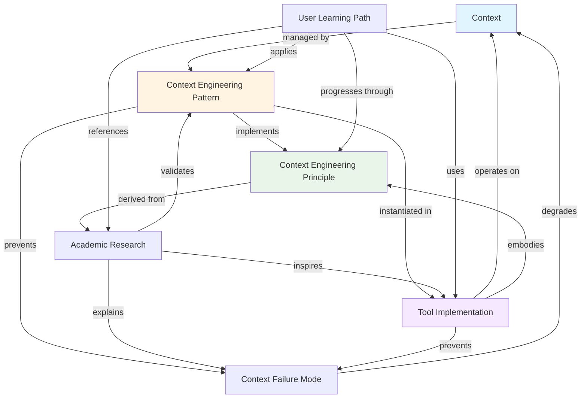

# Data Model: Context Engineering Guide

**Feature**: Context Engineering Guide  
**Date**: January 18, 2026  
**Phase**: Phase 1 - Design

## Overview

This document defines the key entities, relationships, and concepts that form the foundation of the Context Engineering Guide. These entities represent the mental models readers must understand to grasp context engineering principles and apply them in practice.

## Core Entities

### Entity 1: Context

**Definition**: The complete information payload provided to a Large Language Model (LLM) at inference time, encompassing all data the model can access to generate a response.

**Fields**:

- **Instructions**: System prompts and directives (e.g., "You are a helpful assistant")
- **Knowledge**: Domain-specific information, documentation, reference materials
- **Tools**: Functions and capabilities the LLM can invoke (e.g., web search, file read, code execution)
- **Memory**: Conversation history, persistent notes, state information
- **Query**: The immediate user input or task
- **Metadata**: File paths, timestamps, structural markers (XML tags, Markdown headers)

**State Transitions**:

```
Empty → Assembled → Active (during inference) → Compacted → Archived/Discarded
                        ↓
                    Extended (new information added)
                        ↓
                    Compacted (summarized when near limits)
```

**Validation Rules**:

- Total token count must not exceed model's context window (e.g., 200K for Claude 3.5 Sonnet)
- Structural markers (XML, Markdown) must be properly balanced and nested
- Tool definitions must include clear contracts (inputs, outputs, error handling)
- Memory references must be retrievable and up-to-date

**Relationships**:

- Contains multiple **Context Components**
- Managed by **Context Engineering Patterns**
- Subject to **Context Failure Modes**
- Optimized through **Context Lifecycle Stages**

---

### Entity 2: Context Engineering Pattern

**Definition**: A reusable, named approach to structuring, organizing, delivering, or maintaining context for AI systems, based on observed effectiveness in specific scenarios.

**Fields**:

- **Name**: Pattern identifier (e.g., "Structured Note-Taking", "Progressive Disclosure", "Sub-Agent Architecture")
- **Intent**: Problem the pattern solves
- **Motivation**: Why the pattern is needed (e.g., "Prevents context rot", "Manages attention budget")
- **Applicability**: When to use this pattern (scenarios, constraints)
- **Structure**: Components and their relationships (diagrams, code examples)
- **Implementation**: Concrete steps to apply the pattern
- **Consequences**: Trade-offs, benefits, limitations
- **Related Patterns**: Alternative or complementary patterns
- **Tool Mapping**: How pattern manifests in specific tools (Spec Kit, GitHub Copilot)

**Validation Rules**:

- Must have at least one concrete implementation example
- Implementation must be reproducible by readers
- Must document at least one trade-off or limitation
- Must cite academic or production evidence of effectiveness

**Relationships**:

- Applied to **Context** entities
- Implements one or more **Context Engineering Principles**
- Prevents specific **Context Failure Modes**
- Instantiated in **Tool Implementations**

**Examples**:

- **Compaction Pattern**: Summarize conversation nearing context limit, reinitiate with summary
- **MCP Pattern**: Standardized servers for context retrieval across tools
- **CLAUDE.md Pattern**: Single-file project overview for upfront context loading

---

### Entity 3: Context Engineering Principle

**Definition**: A fundamental guideline or rule derived from academic research, production experience, or theoretical foundations that informs effective context design.

**Fields**:

- **Name**: Principle identifier (e.g., "Minimal but Sufficient", "Attention Budget Management")
- **Statement**: Concise principle formulation
- **Academic Source**: Research paper, blog post, or repository that established the principle
- **Rationale**: Theoretical or empirical justification
- **Measurement**: How effectiveness is evaluated (if applicable)
- **Tool-Agnostic Formulation**: Abstract statement independent of specific implementations
- **Tool-Specific Interpretations**: How principle applies in different contexts

**Validation Rules**:

- Must cite at least one authoritative source
- Must be falsifiable or measurable (when applicable)
- Must have at least one concrete implementation example
- Must not contradict other established principles (or explain trade-off)

**Relationships**:

- Informs multiple **Context Engineering Patterns**
- Derived from **Academic Research**
- Implemented through **Tool Features**
- May have **Trade-Offs** with other principles

**Examples**:

1. **Minimal but Sufficient**: Find smallest possible set of high-signal tokens (Anthropic)
2. **Structured Incremental Updates**: Prevent context collapse through careful accumulation (ACE Framework)
3. **System-Level Optimization**: Context is not string manipulation but architectural design (Meirtz)
4. **Progressive Disclosure**: Load information just-in-time based on task needs (emerging pattern)

---

### Entity 4: Context Failure Mode

**Definition**: A specific way that context can become degraded, ineffective, or counterproductive, leading to poor AI agent performance.

**Fields**:

- **Name**: Failure mode identifier (e.g., "Context Poisoning", "Attention Dilution")
- **Description**: What happens when failure occurs
- **Symptoms**: Observable indicators of the failure
- **Root Cause**: Why the failure occurs (architectural, cognitive, or design factors)
- **Impact**: Consequences on agent effectiveness
- **Mitigation Patterns**: Context Engineering Patterns that prevent or recover from this failure
- **Detection**: How to recognize the failure is occurring

**State Transitions**:

```
Normal Operation → Warning Signs → Failure State → Mitigated/Recovered
```

**Relationships**:

- Degrades **Context** quality
- Prevented by **Context Engineering Patterns**
- Addressed by **Tool Features**
- Documented in **Academic Research**

**Examples**:

| Failure Mode | Description | Mitigation Pattern |
|--------------|-------------|-------------------|
| **Context Poisoning** | Bad data corrupting responses | Constitution Gates (Spec Kit), Authoritative Source Declaration (Copilot) |
| **Context Rot** | Declining recall as token count increases | Compaction, Sub-Agent Architectures |
| **Context Distraction** | Irrelevant information diverting focus | Progressive Disclosure, Targeted Retrieval |
| **Context Confusion** | Conflicting information causing errors | Single Source of Truth, Precedence Rules |
| **Context Clash** | Competing priorities in instructions | Explicit Priority Labels, Hierarchical Organization |
| **Brevity Bias** | Dropping domain insights for concise summaries | Structured Incremental Updates (ACE Framework) |
| **Context Collapse** | Detail erosion over iterative rewriting | Documentation-First, Version Control |
| **Attention Dilution** | n² complexity overwhelming model's focus | Sub-Agent Architectures, Context Isolation |

---

### Entity 5: Tool Implementation

**Definition**: A specific feature, workflow, or configuration in Spec Kit or GitHub Copilot that realizes context engineering principles in practice.

**Fields**:

- **Tool**: Which tool (Spec Kit, GitHub Copilot, both)
- **Feature Name**: Specific capability (e.g., "Constitution Gates", ".github/prompts/ files")
- **Pattern Implemented**: Which Context Engineering Pattern(s) this realizes
- **File Path**: Where feature is configured or located (if applicable)
- **Code Example**: Concrete demonstration of usage
- **Configuration**: Setup steps required
- **Effectiveness Evidence**: Metrics or observations of impact

**Validation Rules**:

- Must be currently available in the tool (not speculative)
- Must include working example that readers can reproduce
- Must map to at least one Context Engineering Pattern
- Must document any prerequisites or setup requirements

**Relationships**:

- Realizes **Context Engineering Patterns**
- Embodies **Context Engineering Principles**
- Operates on **Context** entities
- Prevents **Context Failure Modes**

**Examples**:

**Spec Kit Implementations**:

1. **Constitution Gates**: Validates context quality before agent processing (prevents Context Poisoning)
2. **Phase-Based Workflows**: Progressive disclosure limiting information to current stage (prevents Attention Dilution)
3. **.specify/memory/ directory**: Long-term persistent memory across features (implements Memory System pattern)
4. **Templates**: Pre-structured context organization (implements Structured Organization principle)

**GitHub Copilot Implementations**:

1. **.github/prompts/ instruction files**: Persistent system prompts reducing per-interaction overhead (implements Context Curation principle)
2. **Workspace indexing**: Pre-computed embeddings for just-in-time retrieval (implements Hybrid Retrieval pattern)
3. **Tool calling**: Dynamic context loading through semantic_search, read_file (implements Progressive Disclosure)
4. **Conversation compaction**: Auto-summarization preserving key decisions (implements Compaction pattern)

---

### Entity 6: Academic Research

**Definition**: Scholarly papers, engineering blog posts, or curated repositories that provide theoretical foundations, empirical evidence, or best practices for context engineering.

**Fields**:

- **Title**: Full paper or article title
- **Authors**: Primary researchers or organizations
- **Publication**: arXiv, blog, GitHub repository, conference proceedings
- **Date**: Publication date
- **URL**: Direct link to resource
- **Key Contributions**: Primary findings or frameworks introduced
- **Practical Relevance**: How research applies to tool usage
- **Citation Count**: Impact measure (if applicable)

**Validation Rules**:

- Must be publicly accessible (free or open-access)
- Must be directly relevant to context engineering
- Must provide either theoretical foundation, empirical evidence, or practical patterns
- Must be from credible source (peer-reviewed, established engineering blog, or highly-starred repository)

**Relationships**:

- Defines **Context Engineering Principles**
- Validates **Context Engineering Patterns**
- Explains **Context Failure Modes**
- Inspires **Tool Implementations**

**Examples**:

1. arXiv:2510.26493 - Historical evolution and philosophical foundations
2. arXiv:2510.04618 - ACE Framework with empirical performance data (+10.6% improvement)
3. Anthropic Engineering Blog - Production patterns from Claude development
4. Meirtz/Awesome-Context-Engineering - 1,400+ papers and 200+ tools catalogued

---

### Entity 7: User Learning Path

**Definition**: A structured progression through context engineering knowledge, corresponding to user story priorities (P1/P2/P3).

**Fields**:

- **Level**: Beginner (P1), Practitioner (P2), Advanced (P3)
- **Prerequisites**: Required knowledge before starting this level
- **Learning Objectives**: What reader should understand by completion
- **Concepts Covered**: List of entities and patterns introduced
- **Time Estimate**: Expected reading/practice time
- **Assessment Method**: How reader validates their understanding
- **Next Steps**: Progression to next level or related topics

**State Transitions**:

```
Beginner (P1) → Practitioner (P2) → Advanced (P3) → Contributor (creating new patterns)
```

**Validation Rules**:

- Each level must have testable acceptance scenarios (from feature spec)
- Prerequisites must be covered in earlier levels
- Concepts must progress from simple to complex (no forward dependencies)
- Each level must include hands-on examples

**Relationships**:

- Progresses through **Context Engineering Principles**
- Applies **Context Engineering Patterns**
- Uses **Tool Implementations**
- References **Academic Research**

**Level Definitions**:

**Level 1 - Beginner (P1)**:

- **Objectives**: Define context engineering, distinguish from prompt engineering, explain why it matters
- **Concepts**: Context (basic), Context vs. Prompt, Attention Budget, Context Rot
- **Tools**: None (tool-agnostic understanding)
- **Assessment**: Can explain concept in own words, identify why it matters for AI interactions (spec SC-001)

**Level 2 - Practitioner (P2)**:

- **Objectives**: Map theory to practice, improve existing projects, identify patterns in tools
- **Concepts**: Context Engineering Patterns, Tool Implementations, Context Failure Modes
- **Tools**: Spec Kit directory structure, GitHub Copilot .github/prompts/ files
- **Assessment**: Identify 3+ patterns in existing project, implement one improvement (spec SC-002, SC-004)

**Level 3 - Advanced (P3)**:

- **Objectives**: Explore research, design new patterns, contribute to tooling
- **Concepts**: ACE Framework, Multi-Agent Architectures, MCP, Research Frontiers
- **Tools**: mem0, letta, MCP servers, awesome-context-engineering repositories
- **Assessment**: Propose context engineering strategy for multi-agent system (spec acceptance scenario)

---

## Entity Relationships Diagram



## Domain Rules

### Rule 1: Evidence Requirement

Every Context Engineering Pattern must cite at least one Academic Research source or provide empirical data from Tool Implementation.

### Rule 2: Reproducibility

Every Tool Implementation example must be reproducible by readers following documented steps (no "magic" or undocumented configuration).

### Rule 3: Trade-Off Transparency

Every Context Engineering Pattern must document at least one limitation or trade-off (no pattern is universally optimal).

### Rule 4: Progressive Complexity

User Learning Path must sequence concepts so that Entity N never depends on understanding Entity N+1 (no forward references).

### Rule 5: Failure Mode Mapping

Every Context Failure Mode must have at least one mitigation Pattern documented (no "unsolvable" problems).

### Rule 6: Tool-Agnostic Principles

Context Engineering Principles must be stated abstractly first, then mapped to tool-specific implementations (ensures transferability).

### Rule 7: Living References

Academic Research entities must link to publicly accessible resources so readers can verify claims and explore deeper (no paywalled sources).

## Validation Matrix

| Entity | Must Have | Must Not Have | Validated By |
|--------|-----------|---------------|-------------|
| Context | Token count, structural markers | Ambiguous instructions | Context window limits, parser validation |
| Pattern | Concrete example, trade-offs | Vague "best practices" | Reproducibility test |
| Principle | Academic citation | Unsupported opinions | Source verification |
| Failure Mode | Mitigation pattern | Hopeless scenarios | Solution existence check |
| Tool Implementation | Working code example | Speculative features | Manual testing |
| Research | Public URL | Paywalled papers | Link validation |
| Learning Path | Assessment method | Unclear progression | Acceptance scenarios (spec) |

## Next Steps (Contracts Phase)

With entities defined, proceed to:

1. **contracts/outline.md**: Map entities to document sections
2. Each section will introduce/expand specific entities at appropriate Learning Path level
3. Validate that all spec requirements (FR-001 through FR-012) are addressable through these entities

---

**Data Model Complete**: Entities, relationships, and validation rules established. Ready for content structure design.
