# Quick Start: Context Engineering

**Feature**: Context Engineering Guide  
**Date**: January 18, 2026  
**Phase**: Phase 1 - Design

## Purpose

This quick reference enables practitioners to immediately apply context engineering patterns without reading the full guide. Use this when you need fast answers or implementation checklists.

## 30-Second Summary

**Context Engineering** = Systematically designing, organizing, and maintaining the information AI systems use to understand and respond to tasks.

**Not prompt engineering** (just instructions) → **Context engineering** (instructions + tools + memory + data + organization)

**Goal**: Find the smallest set of high-signal information that maximizes AI effectiveness.

---

## Quick Decision Tree

```mermaid
flowchart TD
    Start[Need to improve AI assistance?] --> Question1{What's the problem?}
    
    Question1 -->|AI misses relevant info| Pattern1[Progressive Disclosure §4.3]
    Question1 -->|AI forgets across sessions| Pattern2[Structured Note-Taking §4.4]
    Question1 -->|Inconsistent AI behavior| Pattern3[Validation Gates §5.3]
    Question1 -->|Context too large| Pattern4[Compaction §4.2]
    Question1 -->|Mixed concerns| Pattern5[Sub-Agent Architecture §4.5]
    Question1 -->|Need better organization| Pattern6[Structured Updates §4.1]
    
    style Start fill:#e1f5ff
    style Pattern1 fill:#fff4e1
    style Pattern2 fill:#fff4e1
    style Pattern3 fill:#fff4e1
    style Pattern4 fill:#fff4e1
    style Pattern5 fill:#fff4e1
    style Pattern6 fill:#fff4e1
```



---

## Pattern Quick Reference

| Pattern | Use When | Implementation Time | Primary Benefit |
|---------|----------|-------------------|-----------------|
| **Structured Updates** | Iterative refinement | 30 min | Prevents detail loss |
| **Compaction** | Approaching context limit | 15 min | Extends conversation |
| **Progressive Disclosure** | Large workspace | 45 min | Reduces noise |
| **Structured Note-Taking** | Multi-session work | 20 min | Persistent memory |
| **Sub-Agent Architecture** | Complex research | 60 min | Clean separation |
| **MCP** | External data sources | Varies | Standardized retrieval |

---

## 5-Minute Implementations

### For Spec Kit Users

**Implement: Constitution Gates (Prevents Context Poisoning)**

1. Create `.specify/memory/constitution.md`:

   ```markdown
   # Project Constitution
   
   ## Core Principles
   
   1. [Your principle]: [Why it matters]
   2. [Your principle]: [Why it matters]
   
   ## Quality Gates
   
   - [ ] [Gate 1]: [What to check]
   - [ ] [Gate 2]: [What to check]
   ```

2. Reference in your spec files:

   ```markdown
   ## Constitution Check
   
   - ✓ Principle 1: [How this feature aligns]
   - ✓ Principle 2: [How this feature aligns]
   ```

3. Validate before implementation: If gates fail → reconsider or justify

**Time**: 5 minutes | **Benefit**: Consistent decision-making

---

### For GitHub Copilot Users

**Implement: Instruction Files (Reduces Context Confusion)**

1. Create `.github/prompts/[language].instructions.md`:

   ```markdown
   <instructions>
   You are an expert [language] developer.
   
   <rules>
   - [Rule 1]: [Description]
   - [Rule 2]: [Description]
   </rules>
   
   <examples>
   \```[language]
   // Show your preferred patterns
   \```
   </examples>
   </instructions>
   ```

2. Test: Ask Copilot to implement something, check if rules followed

3. Iterate: Add rules based on observed failure modes

**Time**: 5 minutes | **Benefit**: Consistent code style

---

## Failure Mode Checklist

### Symptoms → Diagnosis → Fix

**🔴 AI gives incorrect or harmful outputs**

- **Diagnosis**: Context Poisoning (bad data in context)
- **Fix**: Add validation gates (Spec Kit) or authoritative source declarations (Copilot)
- **Section**: §5.3, §3.3

**🔴 AI forgets earlier conversation details**

- **Diagnosis**: Context Rot (attention degradation)
- **Fix**: Implement compaction or structured note-taking
- **Section**: §4.2, §4.4

**🔴 AI focuses on wrong information**

- **Diagnosis**: Context Distraction (too much irrelevant info)
- **Fix**: Use progressive disclosure or targeted retrieval
- **Section**: §4.3, §6.4

**🔴 AI gives inconsistent responses**

- **Diagnosis**: Context Confusion (conflicting information)
- **Fix**: Establish single source of truth, clear precedence rules
- **Section**: §5.3, §6.3

**🔴 AI summarizes away important details**

- **Diagnosis**: Brevity Bias
- **Fix**: Use structured incremental updates (ACE Framework)
- **Section**: §4.1

**🔴 Context becoming too large**

- **Diagnosis**: Attention Budget Exhaustion
- **Fix**: Implement compaction, sub-agent architecture, or context isolation
- **Section**: §4.2, §4.5

---

## Implementation Checklists

### Checklist: Set Up Spec Kit Context Engineering

- [ ] Create `.specify/` directory structure
- [ ] Write `constitution.md` with core principles
- [ ] Copy templates from [this repository]
- [ ] Create first spec: `specs/1-feature-name/spec.md`
- [ ] Run `/speckit.plan` command
- [ ] Validate: Check that `plan.md` generated with constitution checks
- [ ] Iterate: Refine constitution based on first feature experience

**Expected Outcome**: Structured context for AI-assisted feature development

---

### Checklist: Set Up Copilot Context Engineering

- [ ] Create `.github/prompts/` directory
- [ ] Write instruction files for primary languages
- [ ] Include project-specific rules and examples
- [ ] Test with Copilot (ask to implement something)
- [ ] Observe: Are instructions followed consistently?
- [ ] Iterate: Add rules for observed failure modes
- [ ] Optional: Create `.copilot/notes.md` for persistent memory

**Expected Outcome**: More consistent, project-aligned AI assistance

---

### Checklist: Optimize Existing Context

- [ ] **Audit Current State**:
  - How much context currently provided? (rough token count)
  - What failure modes observed? (see symptom checklist above)
  - What patterns already in use unconsciously?

- [ ] **Quick Wins** (15 min each):
  - Add instruction file for most-used language (Copilot)
  - Create constitution.md with top 3 principles (Spec Kit)
  - Document one recurring pattern in notes

- [ ] **Medium Investments** (30-60 min each):
  - Implement progressive disclosure for large workspace
  - Set up structured note-taking for multi-session work
  - Create MCP server for frequently-accessed external data

- [ ] **Measure Impact**:
  - Track failure mode occurrences before/after
  - Note subjective improvement in AI helpfulness
  - Document patterns that work for your team

---

## Concept Mapping Cheatsheet

### Academic Concept → Your Tool

**Spec Kit Users**:

```
Structured Updates       → Phase-based workflow (plan.md → research.md → data-model.md)
Memory System           → specs/[feature]/ directories persist across commands
Context Organization    → Templates in .specify/templates/
Progressive Disclosure  → Phase 0 → Phase 1 → Phase 2 (load context per stage)
Validation Gates        → Constitution checks in plan.md
```

**GitHub Copilot Users**:

```
Persistent Prompts      → .github/prompts/*.instructions.md
Just-in-Time Retrieval  → semantic_search + read_file tools
Compaction              → Auto-summarization in long conversations
Memory System           → .copilot/ directory (emerging pattern)
Structured Organization → XML tags: <instructions>, <rules>, <examples>
```

---

## When to Read the Full Guide

**Read §1-§2** (15 min) if:

- You're new to context engineering concept
- Need to explain it to teammates
- Want theoretical foundation

**Read §3-§4** (30 min) if:

- You understand basics, want patterns
- Need to solve specific failure modes
- Planning context architecture

**Read §5** (20 min) if:

- You use Spec Kit
- Want to optimize Spec Kit setup
- Need concrete Spec Kit examples

**Read §6** (20 min) if:

- You use GitHub Copilot
- Want to optimize Copilot instructions
- Need concrete Copilot examples

**Read §7** (15 min) if:

- You're building AI tools
- Need advanced patterns (multi-agent, compression)
- Want research frontier overview

**Read §8** (10 min) if:

- You want academic papers
- Need comprehensive tool lists
- Planning deep exploration

---

## Common Questions

### Q: Is this just prompt engineering renamed?

**A**: No. Prompt engineering = writing instructions. Context engineering = curating all information (instructions + tools + memory + data + organization). See §2.2 for detailed comparison.

### Q: Does more context always help?

**A**: No. Context rot and attention dilution mean quality > quantity. Principle: "Minimal but sufficient" (Anthropic). See §3.2.

### Q: Do I need to be an AI researcher?

**A**: No. Patterns are practical and accessible. This guide provides step-by-step implementations. Start with 5-minute implementations above.

### Q: Which tool should I use?

**A**: Both! Spec Kit for feature development structure, Copilot for real-time assistance. Patterns apply to both. See §5 and §6.

### Q: How do I measure if context engineering is working?

**A**: Track failure mode occurrences, note subjective AI helpfulness, measure task completion success. ACE Framework paper showed +10.6% improvement (§4.1).

### Q: My project is small - do I still need this?

**A**: Yes, but start simple. Even small projects benefit from instruction files (5 min) and basic organization. Scale up as complexity grows.

---

## Next Actions

**If you have 5 minutes**:
→ Implement one 5-minute pattern above

**If you have 30 minutes**:
→ Complete one implementation checklist

**If you have 1 hour**:
→ Read relevant full guide sections (§5 or §6) + implement pattern

**If you want to go deep**:
→ Read full guide (2-3 hours) + explore academic papers (§8)

---

## Get Help

- **Full Guide**: [Link to main docs/context-engineering-guide.md]
- **Academic Papers**: Section §8.1
- **Tool Documentation**: Spec Kit README, GitHub Copilot docs
- **Community**: [Awesome-context-engineering repositories for discussions]

---

**Remember**: Context engineering is about thoughtful information curation, not complex infrastructure. Start small, iterate based on observed failures, and scale as needed.
