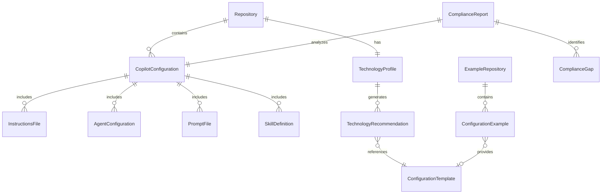
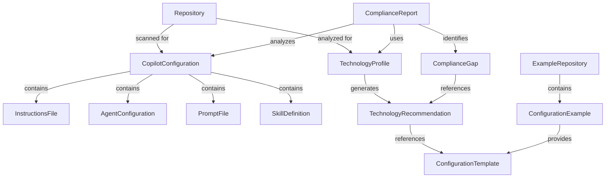
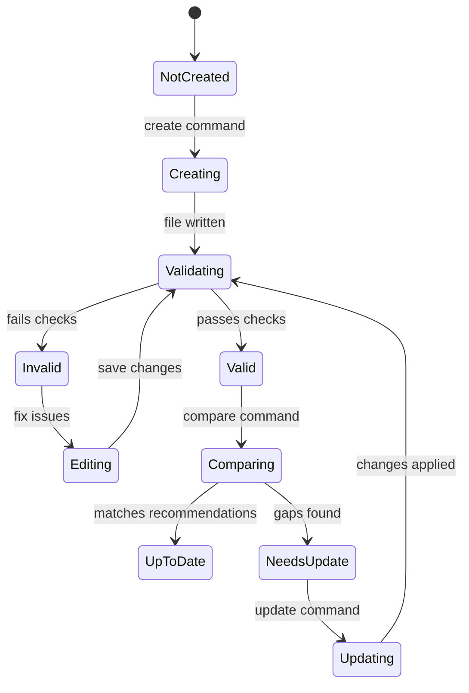
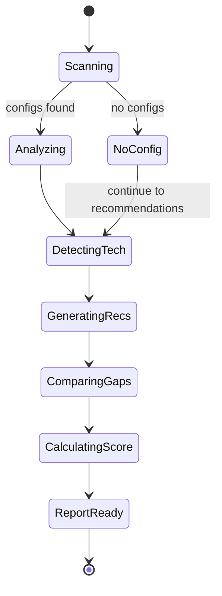

# Data Model: Copilot Config Manager

**Feature**: Copilot Config Manager  
**Spec Directory**: `specs/2-copilot-config-manager`  
**Date**: January 22, 2026

## Entity Overview

This document defines the key entities, their attributes, relationships, and validation rules for the Copilot Config Manager tool.

---

## Entity Definitions

### 1. Repository

Represents the target Git repository being analyzed and configured.

| Attribute | Type | Required | Description |
|-----------|------|----------|-------------|
| `path` | string | Yes | Absolute filesystem path to repository root |
| `name` | string | Yes | Repository name (from `.git/config` or directory name) |
| `gitInitialized` | boolean | Yes | Whether `.git` directory exists |
| `defaultBranch` | string | No | Default branch name (main, master, etc.) |
| `remoteUrl` | string | No | GitHub remote URL if configured |

**Validation Rules**:

- Path must exist and be readable
- Git initialization check before file operations
- Remote URL parsed to extract owner/repo for API calls

---

### 2. CopilotConfiguration

Aggregate representing all Copilot configuration files in a repository.

| Attribute | Type | Required | Description |
|-----------|------|----------|-------------|
| `repositoryPath` | string | Yes | Reference to parent Repository |
| `hasRepoWideInstructions` | boolean | Yes | `.github/copilot-instructions.md` exists |
| `instructionsFiles` | InstructionsFile[] | No | Path-specific instruction files |
| `agentConfigurations` | AgentConfiguration[] | No | Custom agent definitions |
| `promptFiles` | PromptFile[] | No | Reusable prompt templates |
| `skillDefinitions` | SkillDefinition[] | No | Agent skills folders |
| `discoveredAt` | datetime | Yes | When configuration was scanned |

**Derived Properties**:

- `configurationTypes`: List of configuration types present (e.g., ["instructions", "agents"])
- `totalConfigCount`: Sum of all configuration files
- `isConfigured`: At least one configuration file exists

**State Transitions**:

- `UNCONFIGURED` → `PARTIAL` → `COMPLETE`
- State based on presence of recommended configurations for detected technologies

---

### 3. InstructionsFile

A Copilot instructions file providing behavioral guidance.

| Attribute | Type | Required | Description |
|-----------|------|----------|-------------|
| `filePath` | string | Yes | Relative path from repo root |
| `fileName` | string | Yes | File name (e.g., `python.instructions.md`) |
| `fileType` | enum | Yes | `REPO_WIDE` or `PATH_SPECIFIC` |
| `description` | string | Required* | From frontmatter (*required for path-specific) |
| `applyTo` | string[] | Required* | Glob patterns (*required for path-specific) |
| `excludeAgent` | string | No | `code-review` or `coding-agent` |
| `content` | string | Yes | Markdown body content |
| `isValid` | boolean | Yes | Passes validation checks |
| `validationErrors` | string[] | No | List of validation issues |

**File Location Rules**:

- Repo-wide: `.github/copilot-instructions.md`
- Path-specific: `.github/instructions/*.instructions.md`

**Validation Rules**:

- File name must end with `.instructions.md` (path-specific)
- `applyTo` must contain valid glob patterns
- `description` must be non-empty string (10+ characters recommended)
- Content should not be empty

---

### 4. AgentConfiguration

A custom Copilot agent definition file.

| Attribute | Type | Required | Description |
|-----------|------|----------|-------------|
| `filePath` | string | Yes | Relative path from repo root |
| `fileName` | string | Yes | File name (e.g., `test-specialist.agent.md`) |
| `name` | string | No | Display name (defaults to filename) |
| `description` | string | Yes | Agent purpose and capabilities |
| `tools` | string[] | No | Tool names/aliases (empty = all tools) |
| `model` | string | No | AI model identifier (IDE only) |
| `target` | enum | No | `vscode`, `github-copilot`, or `both` |
| `infer` | boolean | No | Auto-selection enabled (default: true) |
| `metadata` | object | No | Key-value annotations (GitHub.com only) |
| `mcpServers` | object | No | MCP server config (org/enterprise only) |
| `handoffs` | Handoff[] | No | Agent transitions (VS Code only) |
| `prompt` | string | Yes | Agent instructions (max 30,000 chars) |
| `isValid` | boolean | Yes | Passes validation checks |
| `validationErrors` | string[] | No | List of validation issues |

**Handoff Sub-entity**:

| Attribute | Type | Required | Description |
|-----------|------|----------|-------------|
| `label` | string | Yes | Button text in UI |
| `agent` | string | Yes | Target agent identifier |
| `prompt` | string | No | Pre-filled prompt text |
| `send` | boolean | No | Auto-submit (default: false) |

**File Location Rules**:

- Repository-level: `.github/agents/*.agent.md`
- Organization/Enterprise: `agents/*.agent.md` (in `.github-private` repo)

**Validation Rules**:

- File name: lowercase, hyphens, alphanumeric, ends with `.agent.md`
- `description` required, non-empty (50-150 chars recommended)
- `tools` must contain valid tool names/aliases
- `prompt` max 30,000 characters

---

### 5. PromptFile

A reusable prompt template for common tasks.

| Attribute | Type | Required | Description |
|-----------|------|----------|-------------|
| `filePath` | string | Yes | Relative path from repo root |
| `fileName` | string | Yes | File name (e.g., `write-tests.prompt.md`) |
| `name` | string | No | Display name (shown after `/` in chat) |
| `description` | string | Recommended | Short task description |
| `agent` | string | No | Target agent (`ask`, `edit`, `agent`, or custom) |
| `model` | string | No | AI model override |
| `tools` | string[] | No | Available tools for prompt |
| `argumentHint` | string | No | Hint text in chat input |
| `content` | string | Yes | Prompt instructions |
| `isValid` | boolean | Yes | Passes validation checks |
| `validationErrors` | string[] | No | List of validation issues |

**File Location Rules**:

- Repository: `.github/prompts/*.prompt.md`

**Validation Rules**:

- File name: lowercase, hyphens, ends with `.prompt.md`
- `description` should be actionable single sentence
- `agent` must be valid agent type or existing agent name

---

### 6. SkillDefinition

A bundled skill with instructions and assets.

| Attribute | Type | Required | Description |
|-----------|------|----------|-------------|
| `folderPath` | string | Yes | Path to skill folder |
| `skillName` | string | Yes | Folder name (1-64 chars) |
| `name` | string | No | Display name from frontmatter |
| `description` | string | Yes | Skill purpose (10-1024 chars) |
| `applyTo` | string[] | No | Optional file scope patterns |
| `content` | string | Yes | SKILL.md body content |
| `assets` | SkillAsset[] | No | Bundled files (templates, examples) |
| `isValid` | boolean | Yes | Passes validation checks |
| `validationErrors` | string[] | No | List of validation issues |

**SkillAsset Sub-entity**:

| Attribute | Type | Required | Description |
|-----------|------|----------|-------------|
| `relativePath` | string | Yes | Path relative to skill folder |
| `type` | enum | Yes | `template`, `example`, `schema`, `other` |
| `fileName` | string | Yes | File name |

**File Location Rules**:

- Skill folder: `skills/[skill-name]/SKILL.md`
- Assets: `skills/[skill-name]/[subdirectory]/[files]`

**Validation Rules**:

- `skillName` length: 1-64 characters
- `description` length: 10-1024 characters
- SKILL.md must exist in folder
- All assets must be valid files

---

### 7. TechnologyProfile

Detected technologies in a repository.

| Attribute | Type | Required | Description |
|-----------|------|----------|-------------|
| `repositoryPath` | string | Yes | Reference to Repository |
| `languages` | TechnologyEntry[] | Yes | Detected programming languages |
| `frameworks` | TechnologyEntry[] | No | Detected frameworks |
| `libraries` | TechnologyEntry[] | No | Notable libraries/dependencies |
| `buildTools` | string[] | No | Build systems detected |
| `testingTools` | string[] | No | Testing frameworks detected |
| `analyzedAt` | datetime | Yes | When analysis was performed |

**TechnologyEntry Sub-entity**:

| Attribute | Type | Required | Description |
|-----------|------|----------|-------------|
| `name` | string | Yes | Technology name |
| `version` | string | No | Version if detectable |
| `confidence` | enum | Yes | `high`, `medium`, `low` |
| `evidence` | string[] | Yes | Files/patterns that indicate presence |
| `fileCount` | number | No | Number of files (for languages) |
| `isPrimary` | boolean | Yes | One of the main technologies |

**Detection Sources**:

- Package manifests: `package.json`, `requirements.txt`, `Cargo.toml`, etc.
- Configuration files: `tsconfig.json`, `pyproject.toml`, etc.
- File extensions: `.py`, `.ts`, `.rs`, etc.
- Framework indicators: `next.config.js`, `angular.json`, etc.

---

### 8. TechnologyRecommendation

A suggested Copilot configuration based on detected technology.

| Attribute | Type | Required | Description |
|-----------|------|----------|-------------|
| `technology` | string | Yes | Technology this applies to |
| `configurationType` | enum | Yes | `instructions`, `agent`, `prompt`, `skill` |
| `priority` | enum | Yes | `P1`, `P2`, `P3` |
| `title` | string | Yes | Recommendation title |
| `rationale` | string | Yes | Why this is recommended |
| `templateId` | string | No | Reference to ConfigurationTemplate |
| `suggestedFileName` | string | Yes | Recommended file name |
| `suggestedContent` | string | No | Pre-populated content |
| `exampleUrls` | string[] | No | Links to example implementations |

**Priority Rules**:

- P1: Primary language/framework (Python, TypeScript, React, etc.)
- P2: Supporting technologies (testing, documentation)
- P3: Optional enhancements (specialized agents)

---

### 9. ConfigurationTemplate

A template for generating configuration files.

| Attribute | Type | Required | Description |
|-----------|------|----------|-------------|
| `id` | string | Yes | Unique template identifier |
| `configurationType` | enum | Yes | `instructions`, `agent`, `prompt`, `skill` |
| `technology` | string | No | Technology this template is for |
| `name` | string | Yes | Template name |
| `description` | string | Yes | Template purpose |
| `variables` | TemplateVariable[] | No | Configurable placeholders |
| `content` | string | Yes | Template content with placeholders |
| `source` | enum | Yes | `builtin`, `awesome-copilot`, `user` |

**TemplateVariable Sub-entity**:

| Attribute | Type | Required | Description |
|-----------|------|----------|-------------|
| `name` | string | Yes | Variable name (e.g., `{{projectName}}`) |
| `description` | string | Yes | What this variable represents |
| `defaultValue` | string | No | Default if not provided |
| `required` | boolean | Yes | Must be provided |

---

### 10. ExampleRepository

A curated repository containing example configurations.

| Attribute | Type | Required | Description |
|-----------|------|----------|-------------|
| `owner` | string | Yes | GitHub owner (e.g., `github`) |
| `name` | string | Yes | Repository name (e.g., `awesome-copilot`) |
| `url` | string | Yes | Full GitHub URL |
| `description` | string | Yes | Repository purpose |
| `lastFetched` | datetime | No | Last successful fetch timestamp |
| `isAvailable` | boolean | Yes | Currently accessible |
| `examples` | ConfigurationExample[] | No | Cached examples |

**Known Repositories**:

- `github/awesome-copilot`: Primary community collection
- `microsoft/hve-core`: Reference implementations (if available)

---

### 11. ConfigurationExample

An example configuration from an external repository.

| Attribute | Type | Required | Description |
|-----------|------|----------|-------------|
| `sourceRepository` | string | Yes | Reference to ExampleRepository |
| `filePath` | string | Yes | Path in source repository |
| `fileName` | string | Yes | File name |
| `configurationType` | enum | Yes | `instructions`, `agent`, `prompt`, `skill` |
| `name` | string | Yes | Display name (from frontmatter or filename) |
| `description` | string | Yes | Example description |
| `technologies` | string[] | No | Technologies this applies to |
| `rawUrl` | string | Yes | URL to fetch raw content |
| `content` | string | No | Cached content (lazy-loaded) |
| `fetchedAt` | datetime | No | When content was last fetched |

---

### 12. ComplianceReport

Result of comparing configuration against recommendations.

| Attribute | Type | Required | Description |
|-----------|------|----------|-------------|
| `repositoryPath` | string | Yes | Reference to Repository |
| `configuration` | CopilotConfiguration | Yes | Current configuration state |
| `technologyProfile` | TechnologyProfile | Yes | Detected technologies |
| `recommendations` | TechnologyRecommendation[] | Yes | Applicable recommendations |
| `gaps` | ComplianceGap[] | Yes | Identified gaps |
| `score` | number | Yes | Compliance percentage (0-100) |
| `generatedAt` | datetime | Yes | When report was generated |

**Scoring Logic**:

- Score = (recommendations met / total recommendations) × 100
- P1 recommendations weighted 3x
- P2 recommendations weighted 2x
- P3 recommendations weighted 1x

---

### 13. ComplianceGap

A specific gap between current configuration and recommendations.

| Attribute | Type | Required | Description |
|-----------|------|----------|-------------|
| `recommendation` | TechnologyRecommendation | Yes | The unmet recommendation |
| `gapType` | enum | Yes | `missing`, `outdated`, `incomplete` |
| `severity` | enum | Yes | `high`, `medium`, `low` |
| `description` | string | Yes | Human-readable gap description |
| `suggestedAction` | string | Yes | How to remediate |
| `autoFixable` | boolean | Yes | Can be automatically fixed |
| `estimatedEffort` | string | No | Time estimate (e.g., "< 1 minute") |

**Gap Types**:

- `missing`: Configuration file doesn't exist
- `outdated`: Content doesn't reflect current best practices
- `incomplete`: File exists but missing required elements

---

## Relationships Summary

---

## State Diagrams

### Configuration File Lifecycle

### Compliance Report Generation

