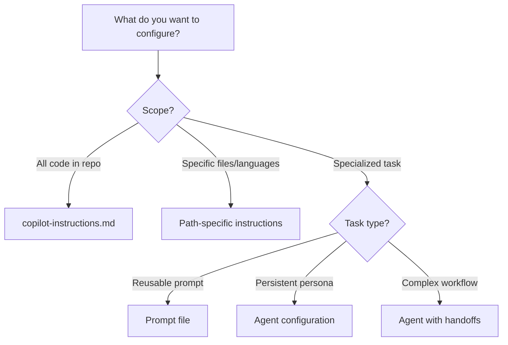

# Quickstart: Copilot Config Manager

**Feature**: Copilot Config Manager  
**Spec Directory**: `specs/2-copilot-config-manager`  
**Date**: January 22, 2026

## 5-Minute Setup

### Prerequisites

- VS Code with GitHub Copilot Chat extension
- Git repository opened in VS Code
- Copilot Config Manager prompts installed in `.github/prompts/copilot-config/`

### Installation

Copy the prompt files to your repository:

```
.github/prompts/copilot-config/
├── cpcontext.scan-configs.prompt.md
├── cpcontext.analyze-technologies.prompt.md
├── cpcontext.create-instructions.prompt.md
├── cpcontext.create-agent.prompt.md
├── cpcontext.create-prompt.prompt.md
├── cpcontext.create-skill.prompt.md
├── cpcontext.compare-recommendations.prompt.md
├── cpcontext.browse-examples.prompt.md
└── cpcontext.validate-configs.prompt.md
```

### Quick Commands

In Copilot Chat, invoke prompts using `/`:

```
/cpcontext.scan-configs
  → Discover existing Copilot configuration files

/cpcontext.analyze-technologies
  → Detect languages and get recommendations

/cpcontext.create-instructions python
  → Create a new instructions file for Python

/cpcontext.create-agent reviewer - code review specialist
  → Create a new custom agent

/cpcontext.compare-recommendations
  → Compare with GitHub best practices

/cpcontext.browse-examples agents
  → Browse community examples from awesome-copilot
```

---

## Common Workflows

### Workflow 1: First-Time Setup

```mermaid
flowchart LR
    A[/cpcontext.analyze-technologies] --> B{Recommendations?}
    B -->|Yes| C[/cpcontext.create-*]
    C --> D[/cpcontext.validate-configs]
    D --> E[git commit]
    B -->|No| F[/cpcontext.create-instructions]
```

**Steps in Copilot Chat:**

```
1. /cpcontext.analyze-technologies
   → Review detected technologies and recommendations

2. /cpcontext.create-instructions python
   → Create instructions for your primary language

3. /cpcontext.create-agent reviewer - code review specialist
   → Add a specialized code review agent

4. /cpcontext.validate-configs
   → Verify all configuration files are valid

5. git add .github/ && git commit -m "Add Copilot configuration"
```

### Workflow 2: Compliance Check

```
1. /cpcontext.compare-recommendations
   → Review current compliance score and gaps

2. For each gap identified:
   /cpcontext.create-instructions {technology}
   /cpcontext.create-agent {name} - {purpose}

3. /cpcontext.validate-configs
   → Confirm all new files are valid
```

### Workflow 3: Add Technology-Specific Instructions

```
/cpcontext.create-instructions typescript

→ Copilot will:
   1. Check if typescript.instructions.md exists
   2. Generate appropriate content with frontmatter
   3. Create .github/instructions/typescript.instructions.md
```

---

## File Location Reference

| Configuration Type | Location |
|-------------------|----------|
| Repository-wide instructions | `.github/copilot-instructions.md` |
| Path-specific instructions | `.github/instructions/*.instructions.md` |
| Agent configurations | `.github/agents/*.agent.md` |
| Prompt files | `.github/prompts/*.prompt.md` |
| Skills | `skills/*/SKILL.md` |

---

## Frontmatter Cheatsheet

### Instructions File

```yaml
---
description: 'Python development guidelines'
applyTo: '**/*.py'
excludeAgent: 'code-review'  # Optional
---
```

### Agent File

```yaml
---
description: 'Testing specialist for unit and integration tests'
name: 'Test Specialist'
tools: ['read', 'edit', 'search', 'execute']
model: 'Claude Sonnet 4.5'  # IDE only
---
```

### Prompt File

```yaml
---
description: 'Generate comprehensive unit tests'
agent: 'agent'
tools: ['read', 'edit']
argument-hint: 'Enter file path to test'
---
```

---

## Troubleshooting

### Issue: Prompts not appearing in Copilot Chat

**Symptom**: `/` commands don't show copilot-config prompts

**Checklist**:

1. ✅ Prompt files in `.github/prompts/copilot-config/` directory
2. ✅ Files end with `.prompt.md`
3. ✅ Valid YAML frontmatter with `description`
4. ✅ Repository opened in VS Code (not remote)

### Issue: Configuration not recognized by Copilot

**Symptom**: Copilot Chat doesn't use your instructions

**Checklist**:

1. ✅ File in correct location (`.github/instructions/`)
2. ✅ File ends with `.instructions.md`
3. ✅ Valid YAML frontmatter with `description` and `applyTo`
4. ✅ Committed to default branch

**Fix**:

```
/validate-configs
```

### Issue: Agent not appearing in dropdown

**Symptom**: Custom agent not visible in Copilot Chat

**Checklist**:

1. ✅ File in `.github/agents/` directory
2. ✅ File ends with `.agent.md`
3. ✅ `description` field present in frontmatter
4. ✅ File committed and pushed

### Issue: Examples unavailable

**Symptom**: `/browse-examples` returns network error

**Workaround**: Visit <https://github.com/github/awesome-copilot> directly

---

## Decision Tree: What to Create



---

## Quick Reference: Tool Aliases

| Alias | Meaning | Use Case |
|-------|---------|----------|
| `execute` | Shell commands | Build, test, run scripts |
| `read` | Read files | Code analysis, context |
| `edit` | Modify files | Write/update code |
| `search` | Find code | Locate patterns, files |
| `agent` | Invoke sub-agents | Orchestration workflows |
| `web` | Web access | Fetch URLs (IDE only) |

---

## Next Steps

1. **Read the full spec**: [spec.md](spec.md)
2. **Explore data model**: [data-model.md](data-model.md)
3. **Review prompt contracts**: [contracts/prompts.md](contracts/prompts.md)
4. **Check research findings**: [research.md](research.md)

---

## External Resources

- [GitHub Docs: Custom Instructions](https://docs.github.com/en/copilot/how-tos/configure-custom-instructions/add-repository-instructions)
- [GitHub Docs: Custom Agents](https://docs.github.com/en/copilot/how-tos/use-copilot-agents/coding-agent/create-custom-agents)
- [awesome-copilot Examples](https://github.com/github/awesome-copilot)
- [VS Code: Custom Agents](https://code.visualstudio.com/docs/copilot/customization/custom-agents)
