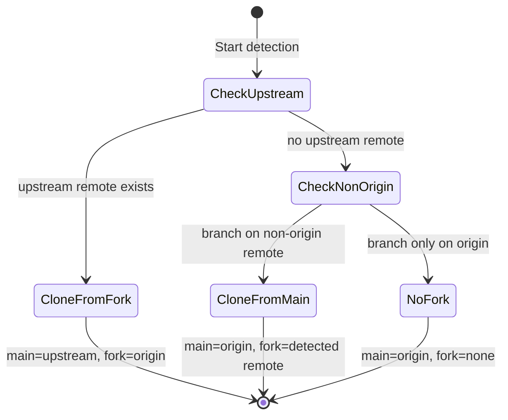
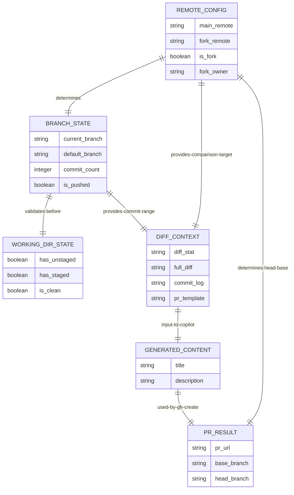
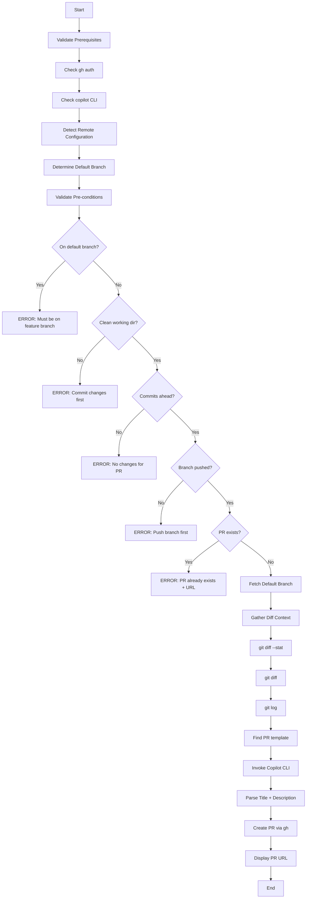

# Data Model: PR Creation Shell Script

**Feature**: PR Creation Shell Script  
**Spec Directory**: `specs/3-pr-creation-script`  
**Date**: February 14, 2026

## Entities

This script operates on transient, in-memory data derived from git and CLI state. There is no persistent storage. All entities exist only for the duration of script execution.

---

### 1. Remote Configuration

The detected remote setup that determines fork status and PR target.

| Field | Type | Description |
|-------|------|-------------|
| `main_remote` | string | Remote pointing to the main repository (`origin` or `upstream`) |
| `fork_remote` | string | Remote pointing to the fork (empty if no fork) |
| `is_fork` | boolean | Whether a fork configuration was detected |
| `fork_owner` | string | GitHub owner of the fork remote (empty if no fork) |
| `main_repo` | string | `owner/repo` of the main repository |
| `detection_method` | enum | `upstream-remote`, `non-origin-branch`, `none` |

**State Transitions**:

---

### 2. Branch State

The current branch and its relationship to the default branch.

| Field | Type | Description |
|-------|------|-------------|
| `current_branch` | string | Name of the current git branch |
| `default_branch` | string | Name of the default branch (e.g., `main`, `master`) |
| `commit_count` | integer | Number of commits ahead of default branch |
| `is_pushed` | boolean | Whether the branch exists on at least one remote |
| `pushed_remote` | string | The remote where the branch has been pushed |

**Validation Rules**:

- `current_branch` must not equal `default_branch`
- `commit_count` must be greater than 0
- `is_pushed` must be true

---

### 3. Working Directory State

The cleanliness of the working directory.

| Field | Type | Description |
|-------|------|-------------|
| `has_unstaged` | boolean | Whether unstaged modifications exist |
| `has_staged` | boolean | Whether staged-but-uncommitted changes exist |
| `is_clean` | boolean | True when both `has_unstaged` and `has_staged` are false |

**Validation Rules**:

- `is_clean` must be true to proceed

---

### 4. Diff Context

The aggregated context passed to the Copilot CLI for content generation.

| Field | Type | Description |
|-------|------|-------------|
| `diff_stat` | string | Output of `git diff --stat` (file change summary) |
| `full_diff` | string | Output of `git diff` (full patch) |
| `commit_log` | string | Output of `git log --oneline` (commit messages) |
| `pr_template` | string | Contents of PR template file (empty if none found) |
| `template_path` | string | Path to the discovered PR template (empty if none) |

---

### 5. Generated PR Content

The title and description produced by the Copilot CLI.

| Field | Type | Description |
|-------|------|-------------|
| `title` | string | PR title (max 72 chars, noun phrase, capitalized first word) |
| `description` | string | PR description (markdown, follows template if available) |

**Validation Rules**:

- `title` must not be empty
- `description` must not be empty
- `title` is extracted from line 1 of Copilot CLI output
- `description` is extracted from line 3+ of Copilot CLI output

---

### 6. PR Result

The outcome of the PR creation.

| Field | Type | Description |
|-------|------|-------------|
| `pr_url` | string | URL of the created pull request |
| `base_branch` | string | The target branch (default branch of main repo) |
| `head_branch` | string | The source branch (with `owner:` prefix for forks) |
| `target_repo` | string | The `owner/repo` the PR targets |

---

## Entity Relationships

## Script Execution Flow

