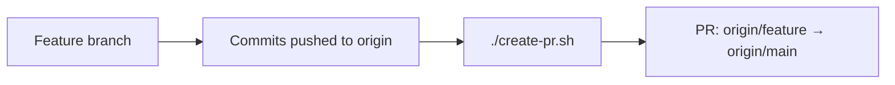
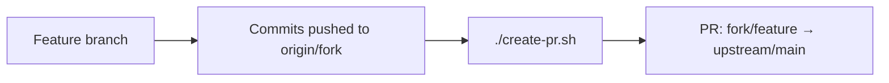
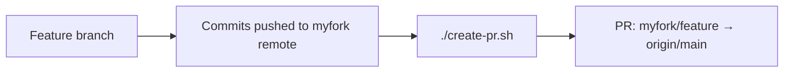
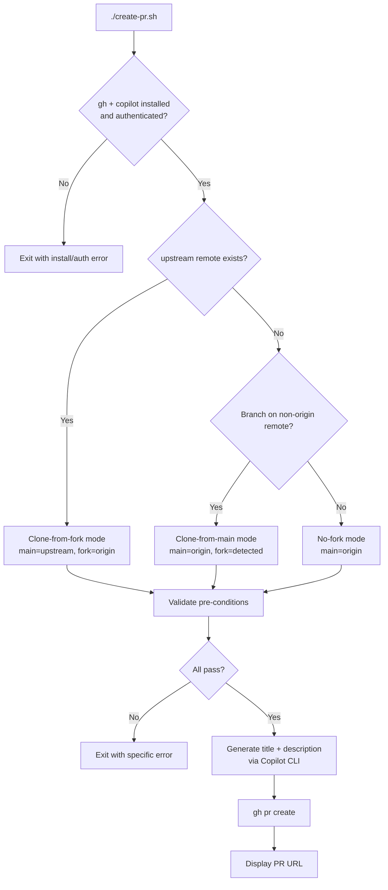

# Quickstart: PR Creation Shell Script

**Feature**: PR Creation Shell Script  
**Spec Directory**: `specs/3-pr-creation-script`  
**Date**: February 14, 2026

## 5-Minute Setup

1. Ensure `gh` CLI is installed and authenticated:

   ```bash
   gh auth status
   ```

2. Ensure `copilot` CLI is on your PATH and authenticated:

   ```bash
   copilot --version
   ```

3. The script lives at repo root as `create-pr.sh`. No installation needed.

## Usage

```bash
# From the repo root, on a feature branch with pushed commits:
./create-pr.sh
```

No arguments. No flags. Everything is auto-detected.

## Common Workflows

### Non-fork repository



```bash
git checkout -b my-feature
# ... make changes ...
git add . && git commit -m "Add feature"
git push origin my-feature
./create-pr.sh
```

### Fork (cloned from fork)



```bash
# origin = your fork, upstream = main repo
git checkout -b my-feature
# ... make changes ...
git add . && git commit -m "Add feature"
git push origin my-feature
./create-pr.sh
# PR targets upstream/main from origin/my-feature
```

### Fork (cloned from main, fork added as remote)



```bash
# origin = main repo, myfork = your fork
git remote add myfork https://github.com/you/repo.git
git checkout -b my-feature
# ... make changes ...
git add . && git commit -m "Add feature"
git push myfork my-feature
./create-pr.sh
# PR targets origin/main from myfork/my-feature
```

## Decision Tree: What Happens When You Run the Script



## Pre-condition Errors and Fixes

| Error | What to do |
|-------|------------|
| "Cannot create PR from the default branch" | Switch to a feature branch: `git checkout -b my-feature` |
| "Uncommitted changes detected" | Commit your changes: `git add . && git commit -m "message"` |
| "No commits ahead" | Make and commit changes on your feature branch |
| "Branch has not been pushed" | Push your branch: `git push origin my-branch` |
| "PR already exists" | Visit the existing PR URL shown in the error |
| "Not authenticated to GitHub CLI" | Run `gh auth login` |
| "Copilot CLI not found" | Install the Copilot CLI and add to PATH |

## What Gets Generated

The Copilot CLI generates:

- **Title**: Noun phrase, max 72 characters, first word capitalized, no conventional commit prefixes
- **Description**: If a PR template exists, follows its structure (including checkboxes). Otherwise, includes summary, modified files list, and commit context.
