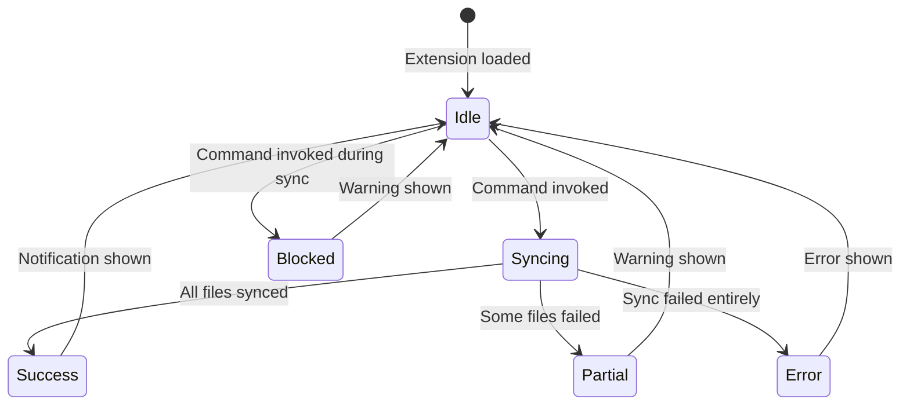
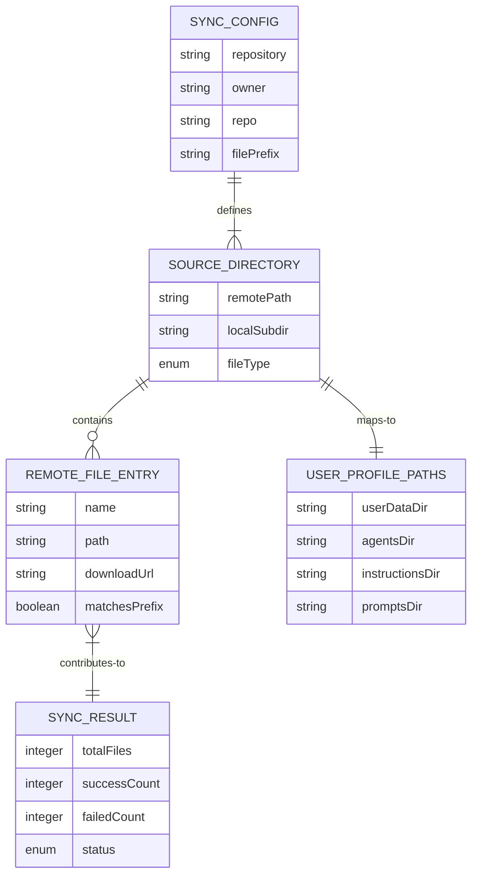
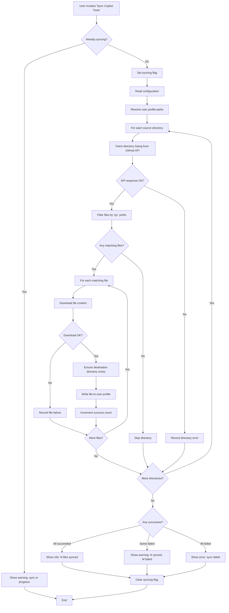

# Data Model: Copilot Tools Sync VS Code Extension

**Feature**: Copilot Tools Sync VS Code Extension
**Spec Directory**: `specs/4-copilot-tools-sync`
**Date**: February 14, 2026

## Entities

This extension operates on transient, in-memory data during a sync operation. There is no persistent storage beyond writing files to the local filesystem. All entities exist only for the duration of a single sync invocation.

---

### 1. Sync Configuration

The resolved configuration for a sync operation, combining extension settings and defaults.

| Field | Type | Description |
| --- | --- | --- |
| `repository` | string | GitHub `owner/repo` identifier (e.g., `brooke-hamilton/cp-context-engineering`) |
| `owner` | string | Parsed repository owner |
| `repo` | string | Parsed repository name |
| `filePrefix` | string | Fixed prefix for matching files (`cp.`), not configurable in v1 |

**Validation Rules**:

- `repository` must match the pattern `owner/repo` (non-empty owner and repo separated by `/`)
- `filePrefix` is always `cp.` (hardcoded)

---

### 2. Source Directory

A directory in the source GitHub repository that contains Copilot customization files.

| Field | Type | Description |
| --- | --- | --- |
| `remotePath` | string | Path in the repository (e.g., `.github/agents/`) |
| `localSubdir` | string | Corresponding subdirectory in the user profile (`agents/`, `instructions/`, `prompts/`) |
| `fileType` | enum | `agent`, `instruction`, `prompt` |

**Fixed Mapping**:

| Remote Path | Local Subdirectory | File Type |
| --- | --- | --- |
| `.github/agents/` | `agents/` | agent |
| `.github/instructions/` | `instructions/` | instruction |
| `.github/prompts/` | `prompts/` | prompt |

---

### 3. Remote File Entry

A file listed in a GitHub repository directory via the Contents API.

| Field | Type | Description |
| --- | --- | --- |
| `name` | string | File name (e.g., `cp.markdown.instructions.md`) |
| `path` | string | Full path in the repository |
| `type` | enum | `file` or `dir` (only `file` entries are processed) |
| `downloadUrl` | string | Direct URL to download raw file content |
| `size` | integer | File size in bytes |
| `matchesPrefix` | boolean | Whether `name` starts with `cp.` |

**Validation Rules**:

- Only entries with `type === "file"` are processed
- Only entries where `name` starts with `cp.` are synced
- `downloadUrl` must be non-null (GitHub API returns null for files > 100MB; unlikely for `.md` files)

---

### 4. User Profile Paths

The resolved local filesystem paths where synced files are written.

| Field | Type | Description |
| --- | --- | --- |
| `userDataDir` | string | Base VS Code user data directory (derived from `globalStorageUri`) |
| `agentsDir` | string | `{userDataDir}/agents/` |
| `instructionsDir` | string | `{userDataDir}/instructions/` |
| `promptsDir` | string | `{userDataDir}/prompts/` |

**Platform Examples**:

| OS | `userDataDir` |
| --- | --- |
| Linux | `~/.config/Code/User/` |
| macOS | `~/Library/Application Support/Code/User/` |
| Windows | `%APPDATA%\Code\User\` |

---

### 5. Sync Result

The outcome of a single sync operation.

| Field | Type | Description |
| --- | --- | --- |
| `totalFiles` | integer | Total number of "cp."-prefixed files found across all directories |
| `successCount` | integer | Number of files successfully written |
| `failedCount` | integer | Number of files that failed to sync |
| `failures` | array | List of `{fileName, error}` for each failed file |
| `status` | enum | `success`, `partial`, `error` |

**State Transitions**:

---

## Entity Relationships

## Sync Execution Flow

