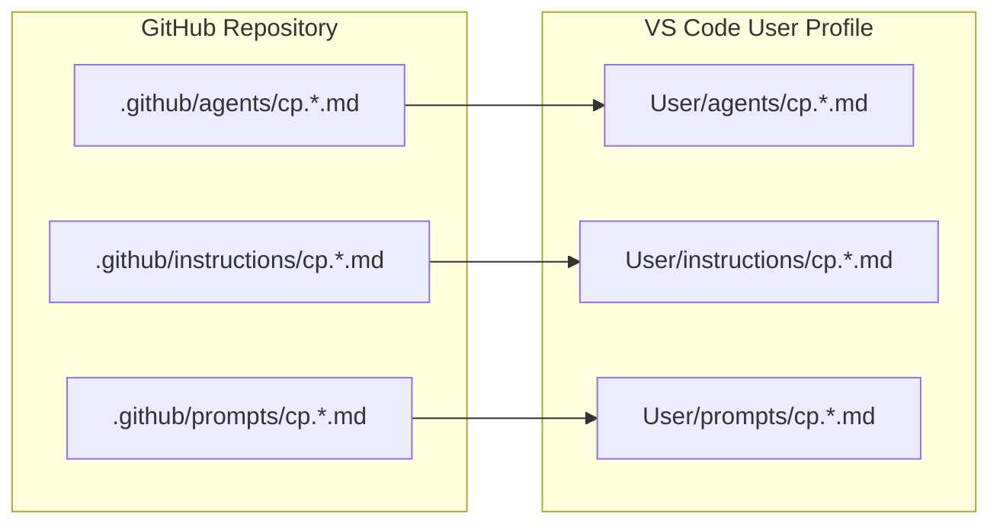
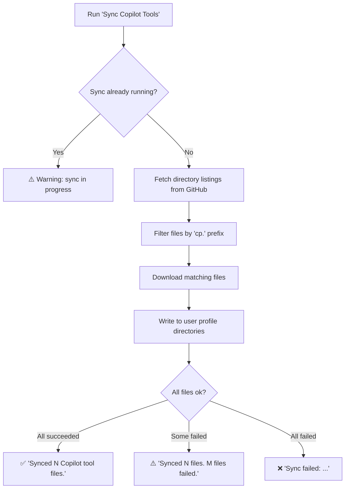

# Quickstart: Copilot Tools Sync VS Code Extension

**Feature**: Copilot Tools Sync VS Code Extension
**Spec Directory**: `specs/4-copilot-tools-sync`
**Date**: February 14, 2026

## 5-Minute Setup

1. Build the extension:

   ```bash
   cd extensions/copilot-tools-sync
   npm install
   npm run compile
   npx vsce package
   ```

2. Install the VSIX:

   ```bash
   code --install-extension copilot-tools-sync-0.0.1.vsix
   ```

3. Reload VS Code (or restart it).

4. Open the Command Palette (`Ctrl+Shift+P` / `Cmd+Shift+P`) and run **Sync Copilot Tools**.

## Usage

```text
Command Palette → "Sync Copilot Tools"
```

No arguments. No flags. The extension fetches "cp."-prefixed files from the configured GitHub repository and copies them into your VS Code user profile.

## What Gets Synced



### Files Currently Matching `cp.*` Prefix

| Directory | File |
| --- | --- |
| `.github/agents/` | `cp.agent-creator.agent.md` |
| `.github/instructions/` | `cp.markdown.instructions.md` |
| `.github/instructions/` | `cp.shell.instructions.md` |
| `.github/prompts/` | `cp.create-agent.prompt.md` |
| `.github/prompts/` | `cp.create-pr.prompt.md` |
| `.github/prompts/` | `cp.validate-agent.prompt.md` |

## Changing the Source Repository

By default, files are synced from `brooke-hamilton/cp-context-engineering`. To change:

1. Open Settings (`Ctrl+,` / `Cmd+,`)
2. Search for "Copilot Tools Sync"
3. Update **Repository** to your preferred `owner/repo`

Or edit `settings.json` directly:

```json
{
  "copilotToolsSync.repository": "your-org/your-repo"
}
```

## Sync Behavior



### Key Behaviors

| Behavior | Description |
| --- | --- |
| **Overwrite** | Existing files with the same name are replaced with the latest version |
| **Additive only** | Local files not in the source repository are never deleted |
| **Directory creation** | Destination directories are created automatically if missing |
| **No authentication** | Only works with public GitHub repositories |
| **No progress bar** | Only a final notification is shown (success, warning, or error) |

## Troubleshooting

| Symptom | Cause | Fix |
| --- | --- | --- |
| "Sync failed: unable to reach repository" | Network issue or repository offline | Check internet connection |
| "Sync failed: repository not found" | Invalid repository setting or private repo | Verify `copilotToolsSync.repository` in settings |
| "Sync failed: GitHub API rate limit exceeded" | More than 60 unauthenticated API requests/hour | Wait and try again later |
| "No Copilot tool files found" | No files starting with `cp.` in the source directories | Verify the repository has `cp.`-prefixed files |
| "A sync is already in progress" | Previous sync still running | Wait for it to complete |
| Command not found in palette | Extension not installed or not activated | Reinstall the VSIX and reload VS Code |

## User Profile Directory Locations

The extension writes files to these OS-specific directories:

| OS | User Profile Base |
| --- | --- |
| Linux | `~/.config/Code/User/` |
| macOS | `~/Library/Application Support/Code/User/` |
| Windows | `%APPDATA%\Code\User\` |

The extension auto-detects the correct path. No manual configuration needed.
